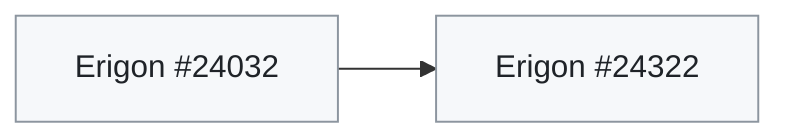
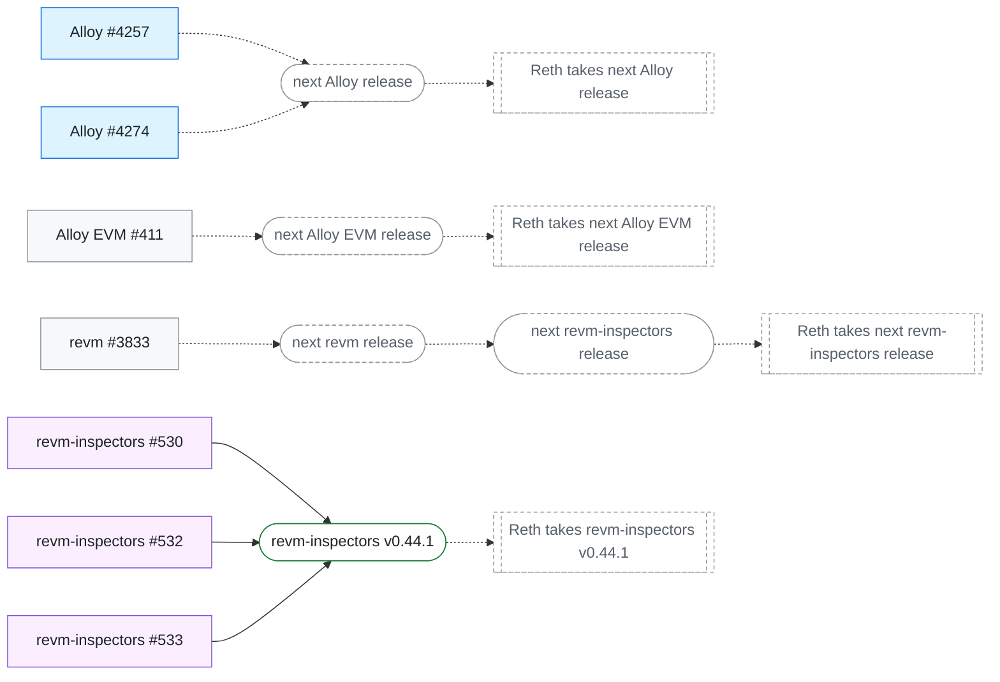

# Client fixes

Upstream PRs for the measured differences, and how far each has travelled toward a verified build. Status checked **2026-10-02**. Generated from [fixes.json](../decisions/fixes.json); `uv run python scripts/refresh_fixes.py` refreshes its PR states and uptake facts.

A library PR is **released** in the first tag containing it at each library hop, and **in client** from the commit where the client’s default-branch `Cargo.lock` first pins that release. Any PR is **in measured build** once a build the current reports assess contains it (its commit, or its lockfile), and **verified** once that build agrees on every decision the PR fully covers, or on its listed `verified_cases`. Until a non-partial PR is in a build, reports show 🛠️ Fix submitted instead of ⚠️, ⛔ or 🟡 for that build and decision; partial PRs are linked without replacing them. Diagrams show the remaining steps: PRs not yet in any measured build, with the prerequisites and release and bump steps they still wait on; dashed steps are pending, and a client with nothing left has none.

## Anvil

| PR | Change | Decisions | Merged | Released | In client | In measured build | Verified |
| --- | --- | --- | --- | --- | --- | --- | --- |
| [Foundry #17089](https://github.com/foundry-rs/foundry/pull/17089) | Return null from trace_transaction for an unknown hash; moves [] to the draft's null; the null-versus-error choice for missing transactions is diverging (H06) | [H06](../reports/decisions/H06.md) (partial) | 2026-09-27 | — | — | dev, stable | — |
| [Foundry #17106](https://github.com/foundry-rs/foundry/pull/17106) | Mark created accounts as added in trace statediff; absent accounts read as absent for the state-diff builder, fixing born-account markers and temporary-account deaths since revm-inspectors 0.44.0 | [H17](../reports/decisions/H17.md), [H26](../reports/decisions/H26.md) | 2026-10-01 | — | — | dev, stable | — |

## Besu

| PR | Change | Decisions | Merged | Released | In client | In measured build | Verified |
| --- | --- | --- | --- | --- | --- | --- | --- |
| [Besu #10953](https://github.com/besu-eth/besu/pull/10953) | Replay block pre-execution before tracing transactions | [H27](../reports/decisions/H27.md), [H28](../reports/decisions/H28.md) | — | — | — | — | — |
| [Besu #11286](https://github.com/besu-eth/besu/pull/11286) | Include MCOPY memory updates in vmTrace | [H20](../reports/decisions/H20.md) (partial) | — | — | — | — | — |
| [Besu #11345](https://github.com/besu-eth/besu/pull/11345) | Keep Parity trace failures local to their call frame | [H24](../reports/decisions/H24.md) | — | — | — | — | — |
| [Besu #11346](https://github.com/besu-eth/besu/pull/11346) | Retain precompile output in Parity call frames | [H22](../reports/decisions/H22.md) | — | — | — | — | — |
| [Besu #11347](https://github.com/besu-eth/besu/pull/11347) | Retain root precompile halt reasons | [H09](../reports/decisions/H09.md) (partial) | — | — | — | — | — |
| [Besu #11350](https://github.com/besu-eth/besu/pull/11350) | Avoid attributing parent return memory to calls | [H20](../reports/decisions/H20.md) (partial) | — | — | — | — | — |
| [Besu #11352](https://github.com/besu-eth/besu/pull/11352) | Retain VM frame positions across omitted opcodes | [H20](../reports/decisions/H20.md) (partial) | — | — | — | — | — |
| [Besu #11353](https://github.com/besu-eth/besu/pull/11353) | Omit root out-of-gas execution effects | [H20](../reports/decisions/H20.md) (partial) | — | — | — | — | — |
| [Besu #11360](https://github.com/besu-eth/besu/pull/11360) | Retain nonzero-value precompile trace frames; covers nested precompile frames only; the phantom frame of a CREATE that fails its balance precheck (B4) has no submitted fix | [H29](../reports/decisions/H29.md) (partial) | — | — | — | — | — |
| [Besu #11362](https://github.com/besu-eth/besu/pull/11362) | Report empty code for self-destructing creations | [H10](../reports/decisions/H10.md) (partial), [H26](../reports/decisions/H26.md) | — | — | — | — | — |
| [Besu #11365](https://github.com/besu-eth/besu/pull/11365) | Start each trace_callMany call at a transaction boundary | [H16](../reports/decisions/H16.md) (partial) | — | — | — | — | — |
| [Besu #11379](https://github.com/besu-eth/besu/pull/11379) | Return null from trace_transaction for unknown hashes; moves [] to the draft's null; the null-versus-error choice for missing transactions is diverging (H06) | [H06](../reports/decisions/H06.md) (partial) | — | — | — | — | — |
| [Besu #11381](https://github.com/besu-eth/besu/pull/11381) | Return block not found from trace_block and block replays; trace_block and trace_replayBlockTransactions return block not found instead of null | [H06](../reports/decisions/H06.md) (partial) | — | — | — | — | — |
| [Besu #11395](https://github.com/besu-eth/besu/pull/11395) | Preserve and validate signed raw trace transactions; Latest main reproductions confirm signed gas clamping, high-s admission and empty type-4 admission. Executes the original transaction with strict fork validation; 28 new HTTP regressions and 1,291 focused tests passed, one skipped. Signed off with the requested GitHub noreply identity. | [H13](../reports/decisions/H13.md) (partial) | — | — | — | — | — |
| [Besu #11401](https://github.com/besu-eth/besu/pull/11401) | Return trace_callMany failures as json-rpc errors; trace_callMany returns a failing bundle as one JSON-RPC error instead of an error envelope inside a successful result; the underlying zero-fee rejection is H15 | [H25](../reports/decisions/H25.md) | 2026-10-02 | — | — | dev | dev |
| [Besu #11404](https://github.com/besu-eth/besu/pull/11404) | Run unpriced trace_call and trace_callMany like eth_call; trace_call and each trace_callMany call select validation with eth_call's rule: unpriced calls run with GASPRICE and BASEFEE 0 and no fee effects, priced calls stay validated and charged, and trace_call validation failures return their reason. Blob pricing keeps eth_call's 1-wei relaxed path and overrides are out of scope (H15); callMany free/priced/free bundles now run for H16's accounting checks, with the transaction boundary left to #11365 and the error envelope to #11401. Independent of both; merges cleanly. | [H15](../reports/decisions/H15.md) (partial), [H16](../reports/decisions/H16.md) (partial) | 2026-10-02 | — | — | dev | — |
| [Besu #11406](https://github.com/besu-eth/besu/pull/11406) | Add trace_replayTransaction; Adds the missing method by reusing block replay's execution and result steps, so each result equals the trace_replayBlockTransactions entry for that transaction (L08). Unknown hash returns null; missing body, state or trie nodes return 4444. Inherits #10953's pre-block system calls through Tracer.processTracing. Remaining Besu trace work is tracked in besu-eth/besu#11405. | [H01](../reports/decisions/H01.md) | — | — | — | — | — |
| [Besu #11407](https://github.com/besu-eth/besu/pull/11407) | Select exactly the blockHash block in trace_filter; trace_filter reads the blockHash member it already parsed: rejects it beside non-null bounds (-32602), traces exactly the canonical block resolved by hash, and returns Block not found (-32000) for unknown or noncanonical hashes, 4444 for a missing body and World state unavailable for missing parent state, before count: 0. 7 new bonsai hash specs and 10 unit tests red before, green after. | [H33](../reports/decisions/H33.md) | — | — | — | — | — |
| [Besu #11432](https://github.com/besu-eth/besu/pull/11432) | Align trace_call and trace_callMany validation with the trace spec draft; trace_callMany names a rejected call’s reason, tip above cap is reported first, the blob rule (BLOBBASEFEE 0 for blob calls without a positive cap, shared with eth_call), and a supplied nonce is ignored in trace_call/callMany; an unpriced call without blobs still sees BLOBBASEFEE 1 | [H15](../reports/decisions/H15.md) (partial) | — | — | — | — | — |

## Erigon

| PR | Change | Decisions | Merged | Released | In client | In measured build | Verified |
| --- | --- | --- | --- | --- | --- | --- | --- |
| [Erigon #23952](https://github.com/erigontech/erigon/pull/23952) | Include MCOPY memory writes in vmTrace | [H20](../reports/decisions/H20.md) (partial) | 2026-09-14 | — | — | dev, stable | — |
| [Erigon #24032](https://github.com/erigontech/erigon/pull/24032) (draft) | Test crash recovery during catch-up reorgs; supersedes #24292: persists safe/finalized from a same-head forkchoice update, which unblocks the reorg scenario | — | — | — | — | — | — |
| [Erigon #24056](https://github.com/erigontech/erigon/pull/24056) | Read account state at the end of the requested block | [H28](../reports/decisions/H28.md) | 2026-09-18 | — | — | dev, stable | dev |
| [Erigon #24255](https://github.com/erigontech/erigon/pull/24255) | Default trace_filter address lists to intersection · after rpc-tests #604 | [H03](../reports/decisions/H03.md), [H04](../reports/decisions/H04.md) | 2026-09-25 | — | — | dev | dev |
| [Erigon #24290](https://github.com/erigontech/erigon/pull/24290) | Read trace_call calldata from `input`; adds `input` only; #24294 adds the remaining call fields | [H14](../reports/decisions/H14.md) (partial) | 2026-09-25 | — | — | dev | — |
| [Erigon #24291](https://github.com/erigontech/erigon/pull/24291) | No vmTrace sub for SELFDESTRUCT or for calls that fail their precheck · after rpc-tests #605 | [H20](../reports/decisions/H20.md) (partial) | 2026-09-25 | — | — | dev | — |
| [Erigon #24293](https://github.com/erigontech/erigon/pull/24293) | Trace_callMany reads state at the end of the requested block | [H28](../reports/decisions/H28.md) | 2026-09-25 | — | — | dev | dev |
| [Erigon #24294](https://github.com/erigontech/erigon/pull/24294) | Trace_call and trace_callMany accept nonce, chainId, blob hashes and authorizations; adds the call fields #24290 leaves out; the unknown-mode and malformed-input error codes remain | [H14](../reports/decisions/H14.md) (partial) | 2026-09-25 | — | — | dev | — |
| [Erigon #24295](https://github.com/erigontech/erigon/pull/24295) | Trace_filter reports no genesis block reward | [H05](../reports/decisions/H05.md) | 2026-09-25 | — | — | dev | dev |
| [Erigon #24322](https://github.com/erigontech/erigon/pull/24322) (draft) | Handle repeated forkchoice outside unwind; Review follow-up targeting https://github.com/erigontech/erigon/pull/24032's branch; parent PR remains required. · after Erigon #24032 | — | — | — | — | — | — |
| [Erigon #24328](https://github.com/erigontech/erigon/pull/24328) | Trace_rawTransaction charges the sender for gas; signed raw transactions only; unsigned trace_call fee accounting follows H15 | [H16](../reports/decisions/H16.md) (partial) | 2026-09-26 | — | — | dev | — |
| [Erigon #24329](https://github.com/erigontech/erigon/pull/24329) | Trace_rawTransaction rejects transactions invalid at latest state; validates nonce, balance, sender code and gas cap; keeps -32000 until the H13 error-code mapping is agreed | [H13](../reports/decisions/H13.md) (partial) | 2026-09-28 | — | — | dev | — |
| [Erigon #24334](https://github.com/erigontech/erigon/pull/24334) | Treat explicit null as omitted in trace_call data/input and trace_filter mode | [H14](../reports/decisions/H14.md) (partial) | 2026-09-27 | — | — | dev | — |
| [Erigon #24336](https://github.com/erigontech/erigon/pull/24336) | Reject call objects whose data and input differ · after Erigon #24334 | [H14](../reports/decisions/H14.md) (partial) | 2026-09-28 | — | — | dev | — |
| [Erigon #24341](https://github.com/erigontech/erigon/pull/24341) | Default an omitted trace_filter fromBlock to latest | [H30](../reports/decisions/H30.md) | 2026-09-27 | — | — | dev | dev |
| [Erigon #24343](https://github.com/erigontech/erigon/pull/24343) | Trace_call and trace_callMany use eth_call's fees and block environment; rebased on #24330, which fixed the fee defaults; keeps the eth_call message rules, block GASLIMIT, overridden block environment and eth_simulateV1 codes. Companion erigontech/rpc-tests#613 | [H15](../reports/decisions/H15.md) | 2026-09-28 | — | — | dev | — |
| [Erigon #24344](https://github.com/erigontech/erigon/pull/24344) | VmTrace reports only operations that executed; needs erigontech/rpc-tests#612 released and RPC_VERSION bumped for its integration tests | [H20](../reports/decisions/H20.md) | 2026-09-29 | — | — | dev | dev |
| [Erigon #24345](https://github.com/erigontech/erigon/pull/24345) | Reject pending in tracing methods with -32602; fixes the pending tag; block-hash filter bounds still accepted | [H32](../reports/decisions/H32.md) (partial) | 2026-09-27 | — | — | dev | — |
| [Erigon #24351](https://github.com/erigontech/erigon/pull/24351) | Trace_call and trace_callMany reject a chainId for another chain | [H14](../reports/decisions/H14.md) (partial) | 2026-09-27 | — | — | dev | — |
| [Erigon #24352](https://github.com/erigontech/erigon/pull/24352) | Trace_rawTransaction reads the block's GASLIMIT | [H15](../reports/decisions/H15.md) (partial) | 2026-09-27 | — | — | dev | — |
| [Erigon #24355](https://github.com/erigontech/erigon/pull/24355) | Report a reverted create as {gasUsed, output} | [H09](../reports/decisions/H09.md) (partial), [H23](../reports/decisions/H23.md) | 2026-09-28 | — | — | dev | dev |
| [Erigon #24356](https://github.com/erigontech/erigon/pull/24356) | Use parity failure labels in trace frames; needs rpc-tests#610 released and RPC_VERSION bumped for its integration tests · after Erigon #24355 | [H09](../reports/decisions/H09.md) | 2026-09-28 | — | — | dev | dev |
| [Erigon #24357](https://github.com/erigontech/erigon/pull/24357) | Trace_filter rejects a bound past the head with -32602; past-head and unknown-hash filter bounds; the reversed range is #24341. Companion erigontech/rpc-tests#611 | [H06](../reports/decisions/H06.md) (partial) | 2026-09-29 | — | — | dev | — |
| [Erigon #24435](https://github.com/erigontech/erigon/pull/24435) | Trace_filter selects a block by blockHash and rejects hash bounds; Implements the converged #890 contract: a blockHash member resolved in the request's read tx by eth_getLogs's resolveLogsBlockHash (canonical only, pruned-body boundary) plus CheckBlockExecuted, before the count: 0 shortcut; blockHash with a non-null bound is -32602; fromBlock/toBlock become rpc.BlockNumber, so hash-string and EIP-1898 object bounds are -32602. Unknown, noncanonical and unexecuted hashes return -32001 (new rpc.ResourceNotFoundError), as H33 recommends, after lupin012's review (e1df6f80805); a pruned body keeps the prune-boundary error, and eth_getLogs and trace_block keep -32000. MCP trace_filter forwards blockHash. No rpc-tests fixture uses hash bounds or blockHash, so no companion PR. 23 new subtests fail on main. | [H33](../reports/decisions/H33.md), [H32](../reports/decisions/H32.md) | — | — | — | — | — |

## Geth draft fork

| PR | Change | Decisions | Merged | Released | In client | In measured build | Verified |
| --- | --- | --- | --- | --- | --- | --- | --- |
| [Geth #35791](https://github.com/ethereum/go-ethereum/pull/35791) (draft) | Add Parity trace RPC namespace; implements the nine Parity trace methods and all three output families; remains a draft while client harmonization and specification work continue; Frontier CREATE code-deposit regression fixed in commit 472c0bd8 on the draft PR branch | — | — | — | — | — | — |

## Nethermind

| PR | Change | Decisions | Merged | Released | In client | In measured build | Verified |
| --- | --- | --- | --- | --- | --- | --- | --- |
| [Nethermind #13551](https://github.com/NethermindEth/nethermind/pull/13551) | Pair instruction trace completions with starts | — | 2026-09-25 | — | — | dev | — |
| [Nethermind #13622](https://github.com/NethermindEth/nethermind/pull/13622) | Report terminal output for top-level action traces | — | 2026-09-25 | — | — | dev | — |
| [Nethermind #13666](https://github.com/NethermindEth/nethermind/pull/13666) | Preserve error responses for streamed traces | [H15](../reports/decisions/H15.md) (partial), [H25](../reports/decisions/H25.md) | 2026-09-27 | — | — | dev | dev |
| [Nethermind #13667](https://github.com/NethermindEth/nethermind/pull/13667) | Accept empty Parity trace selections | [H08](../reports/decisions/H08.md) (partial), [H11](../reports/decisions/H11.md) | 2026-09-24 | — | — | dev, stable | dev, stable |
| [Nethermind #13668](https://github.com/NethermindEth/nethermind/pull/13668) | Serialize deleted account fields with deletion markers; verified in development build 9d6e8b8d | [H17](../reports/decisions/H17.md), [H26](../reports/decisions/H26.md) | 2026-09-24 | — | — | dev, stable | dev, stable |
| [Nethermind #13676](https://github.com/NethermindEth/nethermind/pull/13676) | Preserve trace_get errors and bound positions | [H06](../reports/decisions/H06.md) (partial) | 2026-09-24 | — | — | dev | — |
| [Nethermind #13677](https://github.com/NethermindEth/nethermind/pull/13677) | Reject trace filters with unavailable history | [H06](../reports/decisions/H06.md) (partial) | 2026-09-24 | — | — | dev, stable | — |
| [Nethermind #13750](https://github.com/NethermindEth/nethermind/pull/13750) | Serialize Parity VM stack values as quantities | [H21](../reports/decisions/H21.md) | 2026-09-24 | — | — | dev, stable | dev |
| [Nethermind #13779](https://github.com/NethermindEth/nethermind/pull/13779) | Report vmTrace store without stateDiff | [H20](../reports/decisions/H20.md) (partial) | 2026-09-25 | — | — | dev | — |
| [Nethermind #13780](https://github.com/NethermindEth/nethermind/pull/13780) | Serialize vmTrace store key and value as quantities | [H21](../reports/decisions/H21.md) | 2026-09-24 | — | — | dev | dev |
| [Nethermind #13781](https://github.com/NethermindEth/nethermind/pull/13781) | Report DUPn vmTrace push as n + 1 words | [H20](../reports/decisions/H20.md) (partial) | 2026-09-24 | — | — | dev | — |
| [Nethermind #13782](https://github.com/NethermindEth/nethermind/pull/13782) | Include forwarded gas in streamed vmTrace create cost; covers a CREATE that enters a frame; a CREATE that fails its balance or depth precheck still reports cost 32002 without the forwarded gas | [H20](../reports/decisions/H20.md) (partial) | 2026-09-24 | — | — | dev | — |
| [Nethermind #13783](https://github.com/NethermindEth/nethermind/pull/13783) | Return no traces for the genesis block in trace_block; covers trace_block only; trace_replayBlockTransactions of genesis still fails its parent lookup | [H05](../reports/decisions/H05.md) (partial) | 2026-09-24 | — | — | dev | — |
| [Nethermind #13800](https://github.com/NethermindEth/nethermind/pull/13800) | Match rewards by author in trace_filter address filters; covers rewards only; failed-CREATE recipient matching remains an H23 policy change | [H23](../reports/decisions/H23.md) (partial) | 2026-09-25 | — | — | dev | — |
| [Nethermind #13801](https://github.com/NethermindEth/nethermind/pull/13801) | Return no traces for the genesis block in trace_replayBlockTransactions; covers genesis replay only; the PoS placeholder reward remains | [H05](../reports/decisions/H05.md) (partial) | 2026-09-25 | — | — | dev | — |
| [Nethermind #13834](https://github.com/NethermindEth/nethermind/pull/13834) | Cover reverted child output in action callbacks; Review follow-up merged into master through https://github.com/NethermindEth/nethermind/pull/13622. · after Nethermind #13622 | — | 2026-09-25 | — | — | dev | — |
| [Nethermind #13835](https://github.com/NethermindEth/nethermind/pull/13835) | Keep cancellation policy outside instruction pairing; Review follow-up merged into master through https://github.com/NethermindEth/nethermind/pull/13551. · after Nethermind #13551 | — | 2026-09-25 | — | — | dev | — |
| [Nethermind #13847](https://github.com/NethermindEth/nethermind/pull/13847) | Handle failed precompiles without a vmTrace operation; Fixes buffered vmTrace null dereference on failed top-level precompiles; guards both gas callbacks, including the no-instruction path in #13551. · after Nethermind #13551 | [H20](../reports/decisions/H20.md) (partial) | 2026-09-25 | — | — | dev | — |
| [Nethermind #13857](https://github.com/NethermindEth/nethermind/pull/13857) | Support union and intersection modes in trace_filter; a second commit reads an empty address list as unrestricted (H04), replacing the earlier "matches no address" reading · conflicts with Nethermind #13897 | [H03](../reports/decisions/H03.md), [H04](../reports/decisions/H04.md) | 2026-09-28 | — | — | dev | dev |
| [Nethermind #13858](https://github.com/NethermindEth/nethermind/pull/13858) | Select trace_get results by traceAddress path; changes the response to one object or null; a missing transaction still errors (H06) | [H02](../reports/decisions/H02.md) | 2026-09-26 | — | — | dev | dev |
| [Nethermind #13897](https://github.com/NethermindEth/nethermind/pull/13897) | Read an explicit null input or trace_filter after as omitted · conflicts with Nethermind #13857 | [H14](../reports/decisions/H14.md) (partial) | 2026-09-28 | — | — | dev | — |
| [Nethermind #13935](https://github.com/NethermindEth/nethermind/pull/13935) | Return invalid params for a reversed trace_filter range | [H30](../reports/decisions/H30.md) | 2026-09-28 | — | — | dev | dev |
| [Nethermind #13936](https://github.com/NethermindEth/nethermind/pull/13936) | Reject the pending block tag in trace methods; fixes the pending tag; block-hash filter bounds still accepted | [H32](../reports/decisions/H32.md) (partial) | 2026-09-27 | — | — | dev | — |
| [Nethermind #13937](https://github.com/NethermindEth/nethermind/pull/13937) | Return null from trace_transaction and trace_get for a missing transaction; unknown transaction hashes only; H06 converged on null with Reth and Erigon, Nethermind objecting | [H06](../reports/decisions/H06.md) (partial) | 2026-09-28 | — | — | dev | — |
| [Nethermind #13938](https://github.com/NethermindEth/nethermind/pull/13938) | Return no block reward records for post-merge blocks | [H05](../reports/decisions/H05.md) | 2026-09-28 | — | — | dev | dev |
| [Nethermind #13940](https://github.com/NethermindEth/nethermind/pull/13940) | Report vmTrace call output windows and keep halted operations; a CREATE that fails its precheck still reports its cost without the forwarded gas | [H20](../reports/decisions/H20.md) (partial) | 2026-09-28 | — | — | dev | — |
| [Nethermind #13956](https://github.com/NethermindEth/nethermind/pull/13956) | Reject a trace_call chainId for another chain as invalid params | [H14](../reports/decisions/H14.md) (partial) | 2026-09-28 | — | — | dev | — |
| [Nethermind #13957](https://github.com/NethermindEth/nethermind/pull/13957) | Emit failed frames for calls and creates that fail their precheck · conflicts with Nethermind #13981 | [H29](../reports/decisions/H29.md) | 2026-09-28 | — | — | dev | dev |
| [Nethermind #13958](https://github.com/NethermindEth/nethermind/pull/13958) | Include forwarded gas in the vmTrace cost of a create that enters no frame · after Nethermind #13957 | [H20](../reports/decisions/H20.md) (partial) | 2026-09-28 | — | — | dev | — |
| [Nethermind #13981](https://github.com/NethermindEth/nethermind/pull/13981) | Keep reverted frame results and use parity error labels · conflicts with Nethermind #13957 | [H09](../reports/decisions/H09.md) | 2026-09-29 | — | — | dev | dev |
| [Nethermind #14037](https://github.com/NethermindEth/nethermind/pull/14037) | Return null from trace_replayTransaction for a missing transaction; trace_replayTransaction returns null for a missing transaction, following #13937; the filter bound past the head is #14040 | [H06](../reports/decisions/H06.md) (partial) | 2026-09-29 | — | — | dev | — |
| [Nethermind #14039](https://github.com/NethermindEth/nethermind/pull/14039) | Match a failed CREATE in trace_filter only by its creator; trace_filter matches a failed CREATE only by its creator, since #13981 removed its address from the result | [H23](../reports/decisions/H23.md) | 2026-09-29 | — | — | dev | dev |
| [Nethermind #14040](https://github.com/NethermindEth/nethermind/pull/14040) | Return invalid params for a trace_filter bound past the head; trace_filter and the TraceStore plugin return -32602 for a bound past the head, sharing eth_getLogs' check and message | [H06](../reports/decisions/H06.md) | 2026-09-29 | — | — | dev | dev |
| [Nethermind #14045](https://github.com/NethermindEth/nethermind/pull/14045) | Run zero-fee trace_call and trace_callMany calls with a zero base fee; trace_call and each trace_callMany call priced at zero run with BASEFEE 0 as eth_call does; callMany sets it per call, so free/priced/free sees 0/B/0; blob-fee items remain | [H15](../reports/decisions/H15.md) (partial) | 2026-09-29 | — | — | dev | — |
| [Nethermind #14046](https://github.com/NethermindEth/nethermind/pull/14046) | Reject a priority fee above the fee cap in trace_call and trace_callMany; trace_call and trace_callMany run eth_call's tip-above-cap check, so a tip-only request is rejected for the tip above the defaulted zero cap (code stays -32000); blob-fee items remain | [H15](../reports/decisions/H15.md) (partial) | 2026-09-29 | — | — | dev | — |
| [Nethermind #14048](https://github.com/NethermindEth/nethermind/pull/14048) | Reject a trace_rawTransaction signed for another chain; trace_rawTransaction rejects a legacy or typed transaction signed for another chain before tracing, with eth_sendRawTransaction's chain-id rules; the nonce and EIP-3607 checks still differ | [H13](../reports/decisions/H13.md) (partial) | 2026-09-29 | — | — | dev | — |
| [Nethermind #14049](https://github.com/NethermindEth/nethermind/pull/14049) | Don't select a transaction type from a null field; an explicit null blobVersionedHashes, authorizationList or other type discriminator no longer selects a transaction type in call objects, shared by eth_call, eth_estimateGas, eth_simulateV1 and trace_call | [H14](../reports/decisions/H14.md) (partial) | 2026-09-29 | — | — | dev | — |
| [Nethermind #14050](https://github.com/NethermindEth/nethermind/pull/14050) | Reject unknown members and negative after or count in trace_filter; trace_filter and the TraceStore plugin return -32602 for an unknown filter member or a negative after or count; data/input agreement and the unsigned-call codes remain | [H14](../reports/decisions/H14.md) (partial) | 2026-09-29 | — | — | dev | — |
| [Nethermind #14060](https://github.com/NethermindEth/nethermind/pull/14060) | Reject signed raw transaction gas above the cap; Preserves signed gas when the RPC cap is disabled or sufficient; rejects over-cap raw transactions rather than silently clamping. Reproduced on latest master; 278 TraceRpcModule tests passed. Commit author corrected to the requested GitHub noreply identity. | [H13](../reports/decisions/H13.md) (partial) | 2026-09-30 | — | — | dev | — |
| [Nethermind #14089](https://github.com/NethermindEth/nethermind/pull/14089) | Reject a call object whose data and input differ; differing data and input in a call object are rejected with -32602 and Geth's message instead of the last member winning; equal values, either alone, or one null stay accepted. Shared by eth_call, eth_estimateGas, eth_createAccessList, eth_simulateV1, eth_send/sign/fillTransaction, debug_traceCall and trace_call(Many) | [H14](../reports/decisions/H14.md) | 2026-10-01 | — | — | dev | — |
| [Nethermind #14091](https://github.com/NethermindEth/nethermind/pull/14091) | Validate a trace_rawTransaction with block inclusion's checks; Implements Nethermind's 2026-09-30 #890 position: trace_rawTransaction runs through the validating Execute adapter without LoadNonceFromState (nonce low/high, EIP-3607 with the 7702 delegation exception, fee cap vs base fee, funds, block gas limit) after the node's ITxValidator, in the latest block's context (not head+1); trace_call/callMany and replays unchanged. Existing -32000 mapping kept. 10 new rejection cases fail on master; JsonRpc.Test 3185 passed. Review follow-up 8aebcf8c24 (2026-09-30): head-block context documented; ITracer.ExecuteSigned kept because trace_block's fork-override replay relies on LoadNonceFromState in Execute. | [H13](../reports/decisions/H13.md) | 2026-10-01 | — | — | dev | — |
| [Nethermind #14092](https://github.com/NethermindEth/nethermind/pull/14092) | Run blob calls without a positive blob fee cap at a zero blob base fee; blob-fee-defaulted, blob-fee-zero: trace_call/trace_callMany crashed (-32603 Nullable object must have a value) on a blob call without maxFeePerBlobGas and rejected an explicit 0 at input (-32000). Reworked 2026-10-01 to H15's adopted blob rule: a blob call whose cap is omitted, null or 0 runs with BLOBBASEFEE 0 and pays no blob fee (per-call in trace_callMany, via UnpricedCallTraceAdapter and a blob fee calculator decorator; also trace_rawTransaction), a positive cap is validated and charged, and non-blob calls keep the block's BLOBBASEFEE. eth_call and eth_estimateGas move to the same rule (as Geth's eth_call), so trace_* keeps the eth_call parity the approval rested on; eth_createAccessList keeps send-style defaults as in Geth, and signing/fill still reject a zero cap. debug_traceCall and proof_call are left for a follow-up. Traces on the header the call was converted for. Head 488ad3e895: 19 JsonRpc and 4 Facade cases fail without the fix; JsonRpc.Test 3202 passed, Facade.Test 191 passed. | [H15](../reports/decisions/H15.md) (partial) | 2026-10-01 | — | — | dev | — |
| [Nethermind #14093](https://github.com/NethermindEth/nethermind/pull/14093) | Round-trip TraceStore vm and state; TraceStore vmTrace and nonempty stateDiff could not deserialize, failing every stored trace read; single-pass readers also take legacy hex offsets and deletions, skip unknown members, and read 1,025 nested frames on a 1 MiB stack; native TraceStore suite passed 111 tests on Fedora | — | 2026-10-01 | — | — | dev | — |
| [Nethermind #14111](https://github.com/NethermindEth/nethermind/pull/14111) | Select a block by hash in trace_filter and reject hash bounds; trace_filter and the TraceStore plugin take blockHash for exactly one canonical block (errors for unknown, side-chain, past-head, missing-state and pruned hashes, including with count 0; -32602 with a bound; null omitted) and reject hash-string and EIP-1898 hash bounds with -32602, as Nethermind agreed on execution-apis#890. Also makes the FindBlock head shortcut atomic and returns 4444 for a pruned canonical body. Red on master: 59 of 83 targeted cases; JsonRpc.Test 3242 passed, TraceStore.Test 110 passed. | [H33](../reports/decisions/H33.md), [H32](../reports/decisions/H32.md) | 2026-10-01 | — | — | dev | dev |
| [Nethermind #14115](https://github.com/NethermindEth/nethermind/pull/14115) | Select stored vmTrace like live replay; TraceStore replay returned the stored vmTrace for a trace-only selection and cleared top-level ex.store without stateDiff, unlike live replay (#13779 fixed the live path for H20); native TraceStore suite passed 127 tests on Fedora · after Nethermind #14093 | — | 2026-10-01 | — | — | dev | — |
| [Nethermind #14122](https://github.com/NethermindEth/nethermind/pull/14122) | Require canonical blocks for stored transaction traces; Stored transaction lookups ignored traceNonCanonical, so with CompactTxIndex=false a receipt still pointing at a reorged-out block returned that block's stored traces; native TraceStore suite passed 96 tests on Fedora | — | 2026-10-01 | — | — | dev | — |
| [Nethermind #14123](https://github.com/NethermindEth/nethermind/pull/14123) | Serve only recorded trace types from TraceStore; TraceStore answered requests for trace types it does not record with null fields, e.g. vmTrace and stateDiff on the default Trace, Rewards store; it now falls back to live tracing, as it does for a transaction replay that requests rewards; native TraceStore suite passed 104 tests on Fedora | — | 2026-10-01 | — | — | dev | — |

## Reth

| PR | Change | Decisions | Merged | Released | In client | In measured build | Verified |
| --- | --- | --- | --- | --- | --- | --- | --- |
| [Alloy #4216](https://github.com/alloy-rs/alloy/pull/4216) | Default address filters to intersection | [H03](../reports/decisions/H03.md) | 2026-09-22 | [Alloy v2.5.0](https://github.com/alloy-rs/alloy/tree/v2.5.0) | [2026-09-23](https://github.com/paradigmxyz/reth/commit/458d609fb61d47eabc0ec1c027f1514ec405813c) | dev, stable | dev, stable |
| [Alloy #4218](https://github.com/alloy-rs/alloy/pull/4218) | Serialize absent transaction fields as null | [H05](../reports/decisions/H05.md) | 2026-09-22 | [Alloy v2.5.0](https://github.com/alloy-rs/alloy/tree/v2.5.0) | [2026-09-23](https://github.com/paradigmxyz/reth/commit/458d609fb61d47eabc0ec1c027f1514ec405813c) | dev, stable | dev, stable |
| [Alloy #4257](https://github.com/alloy-rs/alloy/pull/4257) | Treat null trace filter members as omitted | [H04](../reports/decisions/H04.md), [H14](../reports/decisions/H14.md) (partial) | 2026-09-26 | — | — | — | — |
| [Alloy #4274](https://github.com/alloy-rs/alloy/pull/4274) | Add blockHash to TraceFilter; Adds the blockHash member, its builder and block_option() with the bounds-conflict check to Alloy's TraceFilter. Reth and Anvil still need handler changes; Reth's canonical hash resolution is pushed as banteg/reth feat/trace-filter-block-hash and waits for an Alloy release. | [H33](../reports/decisions/H33.md) (partial) | 2026-10-01 | — | — | — | — |
| [Alloy EVM #411](https://github.com/alloy-rs/evm/pull/411) | Preserve fatal system call error sources | [H06](../reports/decisions/H06.md) (partial) | — | — | — | — | — |
| [Reth #27213](https://github.com/paradigmxyz/reth/pull/27213) | Populate VM bytecode in block replay traces · after revm-inspectors #511 | [H19](../reports/decisions/H19.md) | 2026-09-25 | — | — | dev, stable | dev, stable |
| [Reth #27217](https://github.com/paradigmxyz/reth/pull/27217) | Correct Otterscan block and transaction responses | — | 2026-09-25 | — | — | dev, stable | — |
| [Reth #27364](https://github.com/paradigmxyz/reth/pull/27364) | Return null for missing transaction replays | [H06](../reports/decisions/H06.md) (partial) | 2026-09-22 | — | — | dev, stable | — |
| [Reth #27365](https://github.com/paradigmxyz/reth/pull/27365) | Include transaction hash in individual replays | [H07](../reports/decisions/H07.md) | 2026-09-22 | — | — | dev, stable | dev, stable |
| [Reth #27366](https://github.com/paradigmxyz/reth/pull/27366) | Select trace_get results by tree path | [H02](../reports/decisions/H02.md) | 2026-09-22 | — | — | dev, stable | dev, stable |
| [Reth #27367](https://github.com/paradigmxyz/reth/pull/27367) | Classify pruned changeset errors as unavailable history | [H06](../reports/decisions/H06.md) (partial) | 2026-09-22 | — | — | dev, stable | — |
| [Reth #27378](https://github.com/paradigmxyz/reth/pull/27378) | Preserve pruned history errors through execution wrappers | [H06](../reports/decisions/H06.md) (partial) | — | — | — | — | — |
| [Reth #27411](https://github.com/paradigmxyz/reth/pull/27411) | Default trace_filter to latest | [H30](../reports/decisions/H30.md) | 2026-09-24 | — | — | dev, stable | dev, stable |
| [Reth #27423](https://github.com/paradigmxyz/reth/pull/27423) | Omit genesis block reward traces | [H05](../reports/decisions/H05.md) | 2026-09-24 | — | — | dev, stable | dev, stable |
| [Reth #27429](https://github.com/paradigmxyz/reth/pull/27429) | Don't treat stale persisted fcu head as canonical; fixes the intermittent reorg scenario restoration: a stale on-disk head was taken as already canonical | — | 2026-09-25 | — | — | dev, stable | — |
| [Reth #27478](https://github.com/paradigmxyz/reth/pull/27478) | Error on unknown block in trace_replayBlockTransactions; unknown-block replay errors like trace_block | [H06](../reports/decisions/H06.md) (partial) | — | — | — | — | — |
| [Reth #27586](https://github.com/paradigmxyz/reth/pull/27586) | Keep omitted-gas calls within the RPC gas cap; Native Fedora regression: historical block or sender allowance must not raise omitted unsigned-call gas above the RPC cap. | [H15](../reports/decisions/H15.md) (partial) | 2026-10-01 | — | — | dev | — |
| [Reth #27593](https://github.com/paradigmxyz/reth/pull/27593) | Use the local pending block for pending simulations; Locally built pending state returned slot 42 to storage_at but slot 7 to a pending call; Fedora regression and 131 affected RPC tests passed after fix | — | — | — | — | — | — |
| [revm #3833](https://github.com/bluealloy/revm/pull/3833) | Preserve selfdestruct trace payload; fixes revm #3834: a post-Cancun SELFDESTRUCT to self reaches the tracer with its executing account, beneficiary and balance; reaches Reth through revm-inspectors | [H23](../reports/decisions/H23.md) (partial), [H26](../reports/decisions/H26.md) (partial) | — | — | — | — | — |
| [revm-inspectors #504](https://github.com/paradigmxyz/revm-inspectors/pull/504) | Record complete Parity VM execution deltas; its CALL clamp to the copied bytes is one of the two accepted CALL-family ranges; its MLOAD `mem` omission contradicts H20 and needs a follow-up | [H20](../reports/decisions/H20.md) (partial) | 2026-09-14 | [revm-inspectors v0.44.0](https://github.com/paradigmxyz/revm-inspectors/tree/v0.44.0) | [2026-09-25](https://github.com/paradigmxyz/reth/commit/eb03d80dddbf671e256ab235095ad9f3ccfa9923) | dev, stable | — |
| [revm-inspectors #509](https://github.com/paradigmxyz/revm-inspectors/pull/509) | Report EIP-7702 code changes in state diffs | [H18](../reports/decisions/H18.md) | 2026-09-15 | [revm-inspectors v0.44.0](https://github.com/paradigmxyz/revm-inspectors/tree/v0.44.0) | [2026-09-25](https://github.com/paradigmxyz/reth/commit/eb03d80dddbf671e256ab235095ad9f3ccfa9923) | dev, stable | dev, stable |
| [revm-inspectors #510](https://github.com/paradigmxyz/revm-inspectors/pull/510) | Report selfdestructed account deletions | [H26](../reports/decisions/H26.md) (partial) | 2026-09-15 | [revm-inspectors v0.44.0](https://github.com/paradigmxyz/revm-inspectors/tree/v0.44.0) | [2026-09-25](https://github.com/paradigmxyz/reth/commit/eb03d80dddbf671e256ab235095ad9f3ccfa9923) | dev, stable | — |
| [revm-inspectors #511](https://github.com/paradigmxyz/revm-inspectors/pull/511) | Record executed bytecode in VM traces | [H19](../reports/decisions/H19.md) | 2026-09-22 | [revm-inspectors v0.44.0](https://github.com/paradigmxyz/revm-inspectors/tree/v0.44.0) | [2026-09-25](https://github.com/paradigmxyz/reth/commit/eb03d80dddbf671e256ab235095ad9f3ccfa9923) | dev, stable | dev, stable |
| [revm-inspectors #526](https://github.com/paradigmxyz/revm-inspectors/pull/526) | Preserve account existence in state diffs | [H17](../reports/decisions/H17.md) | 2026-09-24 | [revm-inspectors v0.44.0](https://github.com/paradigmxyz/revm-inspectors/tree/v0.44.0) | [2026-09-25](https://github.com/paradigmxyz/reth/commit/eb03d80dddbf671e256ab235095ad9f3ccfa9923) | dev, stable | dev, stable |
| [revm-inspectors #528](https://github.com/paradigmxyz/revm-inspectors/pull/528) | Report vmTrace store from SSTORE operands | [H20](../reports/decisions/H20.md) (partial) | 2026-09-25 | [revm-inspectors v0.44.0](https://github.com/paradigmxyz/revm-inspectors/tree/v0.44.0) | [2026-09-25](https://github.com/paradigmxyz/reth/commit/eb03d80dddbf671e256ab235095ad9f3ccfa9923) | dev, stable | — |
| [revm-inspectors #530](https://github.com/paradigmxyz/revm-inspectors/pull/530) | Report no storage slots for a deleted account; storage: {} for deleted accounts; the post-Cancun self-destruct-to-self payload is revm #3833, and no captured fixture yet deletes an account with storage | [H26](../reports/decisions/H26.md) (partial) | 2026-09-29 | [revm-inspectors v0.44.1](https://github.com/paradigmxyz/revm-inspectors/tree/v0.44.1) | — | — | — |
| [revm-inspectors #532](https://github.com/paradigmxyz/revm-inspectors/pull/532) | Match vmTrace ops and subs to execution | [H20](../reports/decisions/H20.md) | 2026-09-29 | [revm-inspectors v0.44.1](https://github.com/paradigmxyz/revm-inspectors/tree/v0.44.1) | — | — | — |
| [revm-inspectors #533](https://github.com/paradigmxyz/revm-inspectors/pull/533) | Report reverted creations without an address | [H09](../reports/decisions/H09.md), [H23](../reports/decisions/H23.md) | 2026-09-29 | [revm-inspectors v0.44.1](https://github.com/paradigmxyz/revm-inspectors/tree/v0.44.1) | — | — | — |

## Specifications, tests and other repositories

No measured build consumes these repositories.

| PR | Change | Decisions | Merged | Released | In client | In measured build | Verified |
| --- | --- | --- | --- | --- | --- | --- | --- |
| [execution-apis #895](https://github.com/ethereum/execution-apis/pull/895) (draft) | Parity trace methods and output schemas | — | — | — | — | — | — |
| [rpc-tests #604](https://github.com/erigontech/rpc-tests/pull/604) | Make trace filter union fixtures explicit | [H03](../reports/decisions/H03.md) | 2026-09-23 | — | — | — | — |
| [rpc-tests #605](https://github.com/erigontech/rpc-tests/pull/605) | Align SELFDESTRUCT vmTrace fixtures with frame semantics; Companion mainnet fixtures for erigon#24291; draft until the client fix lands. | [H20](../reports/decisions/H20.md) | 2026-09-25 | — | — | — | — |
| [Silkworm #2885](https://github.com/erigontech/silkworm/pull/2885) (draft) | Capture missing vmTrace opcode effects | [H20](../reports/decisions/H20.md) | — | — | — | — | — |

## Closed

- [Erigon #24292](https://github.com/erigontech/erigon/pull/24292): Apply safe and finalized from a same-head fork choice; closed in favor of #24032, which applies the same-head safe/finalized update; our regression tests pass on it (fixes #24028)
- [Nethermind #13665](https://github.com/NethermindEth/nethermind/pull/13665): Retain output in state-only Parity traces
