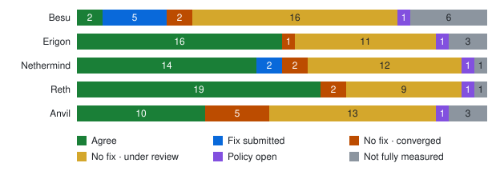

# Trace API: what would change?

The clients already share much of the `trace_*` API. These reports show where adopting the [draft specification](https://github.com/banteg/execution-apis/tree/e437815dba041158b7079bf149052fb7301f8419) would change their behavior. Start with your client, then use the examples and source links to review a proposed change.

Published builds checked at **2026-09-26T08:35:29.730208+00:00**. [Freshness preflight](../evidence/2026-09-26/anvil/preflight.json) · [Build lock](../evidence/2026-09-26/anvil/clients.lock.json). All corpora use this snapshot; later upstream changes require a new capture.

For verdicts that changed since the last capture, see [changes since the previous matrix](changes.md).

## Progress

Across the Besu, Erigon, Nethermind and Reth development builds, **51 of 128** client decisions agree with the draft. 7 more have a submitted fix, and **55 differ with no fix yet**: 7 on converged decisions and 48 on decisions still under review. 16 agreements are in development builds but not yet in a stable release.

| Client | Build | ✅ Agree | 🛠️ Fix submitted | ⚠️ No fix · converged | ⚠️ No fix · under review | ❔ Policy open | ⚪ Not fully measured | In dev, not stable | Fix PRs merged / open |
| --- | --- | --- | --- | --- | --- | --- | --- | --- | --- |
| [Besu](clients/besu.md) | 26.9-develop · accdae00 | 2 | 5 | 2 | 16 | 1 | 6 | 0 | 0 / 11 |
| [Erigon](clients/erigon.md) | 3.8.0-dev · 7853b922 | 16 | 0 | 1 | 11 | 1 | 3 | 3 | 9 / 5 |
| [Nethermind](clients/nethermind.md) | 2.1.0-preview · fca93966 | 14 | 2 | 2 | 12 | 1 | 1 | 4 | 18 / 3 |
| [Reth](clients/reth.md) | 2.5.2 · df7b7fdf | 19 | 0 | 2 | 9 | 1 | 1 | 9 | 16 / 5 |
| [Anvil](clients/anvil.md) | 1.8.4-nightly · 5a99f1a8 | 9 | 0 | 5 | 14 | 1 | 3 | 0 | 0 / 0 |

Each client has one outcome per decision on its development build. A difference with no submitted fix is the rough measure of pending work; one decision can need several changes, and a PR can cover part of a decision or several. “Converged” and “under review” refer to the decision’s policy status. “In dev, not stable” counts agreements that the stable release does not share yet. Fix PRs are upstream PRs attributed to the client, including its libraries; closed PRs are excluded. The Geth draft fork implements the proposal and is not counted. Anvil, Foundry’s development node, is shown for tooling compatibility and is not in the totals above. [Status key](technical.md#test-status-key) · [Policy status](../decisions/README.md#status-key)

## Start with your client

| Client | Main review areas |
| --- | --- |
| [Anvil](clients/anvil.md) | Foundry’s development node, captured by replaying each chain instead of through Hive; 1.8.3 and the nightly return identical trace responses. Its trace output comes from revm-inspectors 0.43.0, so the stateDiff, EIP-7702, vmTrace and SELFDESTRUCT fixes already in Reth’s nightly arrive with a dependency bump. Its own RPC layer differs in tree-path lookup, missing-item results, replay transaction hashes, unrequested call frames, conflicting data/input, zero-fee BASEFEE, omitted filter bounds and the trace_callMany default block. Mined-trace methods also return precompile frames that its trace_call omits. The mined-probes chain cannot be replayed because Anvil cannot set a parent beacon root. |
| [Besu](clients/besu.md) | Start with failed-frame reporting, precompile output and inclusion, and range-filter consistency. Individual replay also needs a scope decision. |
| [Erigon](clients/erigon.md) | The development build agrees on tree lookup, default filter composition, MCOPY, historical system state including trace_callMany, and the genesis reward, several of which still differ in 3.7.0. Signed-transaction validity checks and error codes need alignment with the proposal (#24329 is open), and omitted trace_filter bounds still search history instead of the proposed latest/latest default. |
| [Geth draft fork](clients/geth.md) | The experimental fork follows the adopted source-review stances; its checked cases agree on every assessed decision except the H12 raw-transaction block argument and simulation pending, which remain policy observations. It is not upstream Geth support or a consensus vote. Filtering remains a bounded scan; pruning still needs runtime coverage. |
| [Nethermind](clients/nethermind.md) | 2.1.0-unstable · 641592d2 fixes empty trace selections, state-only output, empty-code birth/deletion markers and stack-word quantities. 2.0.0 · bec830cd still differs. Complete validation errors, tree lookup and other serialization details remain review areas. |
| [Reth](clients/reth.md) | Reth 2.5.2 · df7b7fdf, the first nightly with revm-inspectors 0.44.0, fixes tree-path lookup, default filter intersection, missing-replay nulls, replay transaction hashes, the genesis reward, omitted filter bounds, the omitted trace_callMany block, new-account stateDiff markers, EIP-7702 code changes and executing initcode in vmTrace; all of these still differ in 2.6.0 · 73a3a008. Remaining work includes simulation fees, the rest of vmTrace, the SELFDESTRUCT payload (revm #3833) and error-code alignment. |

## Decisions to review

The largest API choices are [tree-path lookup](decisions/H02.md), [address-filter composition](decisions/H03.md), and [failed-frame results](decisions/H09.md). Other rows concern missing information or inconsistent execution/reporting. All recommendations remain proposals for client review.

| Question | Status | Proposed behavior |
| --- | --- | --- |
| [How does trace_get select a frame?](decisions/H02.md) | 🤝 Converged | Follow one tree path; return one object or null. An empty path selects the root. |
| [How do address filters combine?](decisions/H03.md) | 🤝 Converged | OR within each list, AND between sender and recipient lists. |
| [Where does an unbounded filter start?](decisions/H30.md) | ⚪ Under review | Default both omitted bounds to latest; historical searches specify fromBlock. |
| [What block does trace_callMany use by default?](decisions/H31.md) | ⚪ Under review | Accept an omitted block and use latest, matching trace_call. |
| [Which tags and pending state can trace methods use?](decisions/H32.md) | ⚪ Under review | Resolve mined-block tags; agree pending state and localization per method. |
| [What survives a failed call?](decisions/H09.md) | ⚪ Under review | Keep the error on that frame and preserve revert bytes and measured gas when available. |
| [Which precompile frames are visible?](decisions/H29.md) | ⚪ Under review | Keep root frames and nested frames with nonzero value; omit zero-value nested frames. |
| [Signed transaction execution validity](decisions/H13.md) | 🤝 Converged | Validate against the selected state, including nonce, funds and gas. Keep pool policies separate; propose -32003 for validation rejection. |

[Status definitions](../decisions/README.md#status-key). Policy direction is distinct from verified implementation on the captured builds.

[All decisions](../decisions/README.md) · [Method availability](decisions/H01.md)

[Client fixes](../docs/client-fixes.md) · [Client source guide](sources.md) · [Run a case](../docs/usage.md) · [Builds, coverage and raw results](technical.md) · [Consistency laws](laws.md) · [Spec decision tables](spec-tables.md) · [Standardization discussion](https://github.com/ethereum/execution-apis/issues/890)
