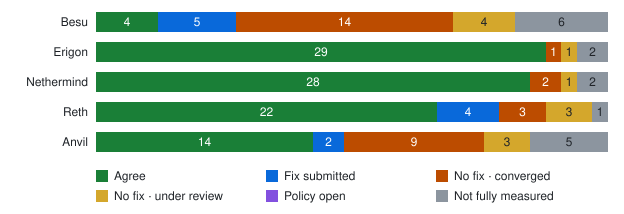

# Trace API: what would change?

The clients already share much of the `trace_*` API. These reports show where adopting the [draft specification](https://github.com/banteg/execution-apis/tree/66bf490273d35e75dd46b709c0ad19ab9b98f17f) would change their behavior. Start with your client, then use the examples and source links to review a proposed change.

Published builds checked at **2026-09-30T13:03:47.160133+00:00**. [Freshness preflight](../evidence/2026-09-30/eval/preflight.json) · [Build lock](../evidence/2026-09-30/eval/clients.lock.json). All corpora use this snapshot; later upstream changes require a new capture.

For verdicts that changed since the last capture, see [changes since the previous matrix](changes.md).

## Progress

Across the Besu, Erigon, Nethermind and Reth development builds, **81 of 132** client decisions agree with the draft. 18 more have a submitted fix, and **23 differ with no fix yet**: 19 on converged decisions and 4 on decisions still under review. 29 agreements are in development builds but not yet in a stable release.

| Client | Build | ✅ Agree | 🛠️ Fix submitted | ⚠️ No fix · converged | ⚠️ No fix · under review | ❔ Policy open | ⚪ Not fully measured | In dev, not stable | Fix PRs merged / open |
| --- | --- | --- | --- | --- | --- | --- | --- | --- | --- |
| [Besu](clients/besu.md) | 26.9-develop · 67ce4ab1 | 4 | 8 | 13 | 2 | 0 | 6 | 0 | 0 / 18 |
| [Erigon](clients/erigon.md) | 3.8.0-dev · 923b4d31 | 28 | 2 | 1 | 0 | 0 | 2 | 14 | 21 / 3 |
| [Nethermind](clients/nethermind.md) | 2.2.0-preview · 79173d14 | 27 | 4 | 0 | 1 | 0 | 1 | 15 | 39 / 8 |
| [Reth](clients/reth.md) | 2.7.0 · 43a93dbc | 22 | 4 | 5 | 1 | 0 | 1 | 0 | 21 / 7 |
| [Anvil](clients/anvil.md) | 1.8.4-nightly · e3429853 | 14 | 2 | 11 | 1 | 0 | 5 | 4 | 1 / 1 |

Each client has one outcome per decision on its development build. A difference with no submitted fix is the rough measure of pending work; one decision can need several changes, and a PR can cover part of a decision or several. “Converged” and “under review” refer to the decision’s policy status. “In dev, not stable” counts agreements that the stable release does not share yet. Fix PRs are upstream PRs attributed to the client, including its libraries; closed PRs are excluded. The Geth draft fork implements the proposal and is not counted. Anvil, Foundry’s development node, is shown for tooling compatibility and is not in the totals above. [Status key](technical.md#test-status-key) · [Policy status](../decisions/README.md#status-key)

## Start with your client

| Client | Main review areas |
| --- | --- |
| [Anvil](clients/anvil.md) | Foundry’s development node, captured by replaying each chain instead of through Hive. The nightly 1.8.4 · 00989695 takes up revm-inspectors 0.44.0 (#17073), which brings the EIP-7702 stateDiff, executing-bytecode and vmTrace step fixes also in Reth 2.7.0, corrects the empty trace-type selection, omitted filter bounds and the trace_callMany default block (#17078) and returns null from trace_transaction for a missing transaction (#17089); 1.8.3 still differs on all of these. With 0.44.0 the nightly also loses the creation markers of a contract created in trace_call and reports an account created and destroyed in one transaction as deleted (open #17106 fixes both). Its own RPC layer still differs in tree-path lookup, missing blocks and replays, replay transaction hashes, conflicting data/input and zero-fee BASEFEE. Mined-trace methods also return precompile frames that its trace_call omits. The mined-probes chain cannot be replayed because Anvil cannot set a parent beacon root. |
| [Besu](clients/besu.md) | Start with failed-frame reporting, precompile output and inclusion, and range-filter consistency. Individual replay also needs a scope decision. |
| [Erigon](clients/erigon.md) | The development build agrees on tree lookup, default filter composition, MCOPY, historical system state including trace_callMany, the genesis reward, omitted trace_filter bounds (#24341), reverted-CREATE results and failure labels (#24355, #24356) and failed-CREATE filter matching, several of which still differ in 3.7.0. Since #24330 and #24343 its trace_call prices gas like eth_call, keeps the block GASLIMIT and returns the eth_simulateV1 codes. It validates signed transactions at the selected state (#24329) rejecting each for its own violation (with -32000; the error-group codes are recommended); a filter bound past the head still returns [] (#24357 is open) and vmTrace still keeps halted-operation details (#24344 is open). |
| [Geth draft fork](clients/geth.md) | The experimental fork follows the adopted source-review stances; its checked cases agree on every assessed decision, including pending simulations, which it runs in a real pending environment; pending block traces stay blocked on the frozen chain’s empty pending block, and one H14 input policy is open; it rejects the H12 raw-transaction block argument, an extension outside the baseline. It is not upstream Geth support or a consensus vote. Filtering remains a bounded scan; pruning still needs runtime coverage. |
| [Nethermind](clients/nethermind.md) | 2.2.0-preview · 287f54f0 agrees on filter modes and empty address lists (#13857), post-merge and genesis reward records (#13938, #13783, #13801), vmTrace steps (#13940, #13958), precheck and collision frames (#13957) and failed-frame results and labels (#13981); 2.0.0 · bec830cd still differs on all of these. trace_transaction and trace_get return null for a missing transaction (#13937), but trace_replayTransaction still errors (#14037 is open). trace_filter still matches a failed CREATE by its would-be address; raw-transaction validation, malformed-input rejection, simulation fees and block-hash filter bounds remain review areas. |
| [Reth](clients/reth.md) | Reth 2.7.0 · 3d592ece, with revm-inspectors 0.44.0, ships tree-path lookup, default filter intersection, missing-replay nulls, replay transaction hashes, the genesis reward, omitted filter bounds, the omitted trace_callMany block, new-account stateDiff markers, EIP-7702 code changes and executing initcode in vmTrace, all of which differed in 2.6.0; the nightly 2.7.0 · 43a93dbc, built from main after the release, returns the same responses. Remaining work includes simulation fees, the rest of vmTrace, null filter address lists (Alloy #4257, not yet in an Alloy release) and the SELFDESTRUCT payload (revm #3833). |

## Decisions to review

The largest API choices are [tree-path lookup](decisions/H02.md), [address-filter composition](decisions/H03.md), and [failed-frame results](decisions/H09.md). Other rows concern missing information or inconsistent execution/reporting. All recommendations remain proposals for client review.

| Question | Status | Proposed behavior |
| --- | --- | --- |
| [How does trace_get select a frame?](decisions/H02.md) | 🤝 Converged | Follow one tree path; return one object or null. An empty path selects the root. |
| [How do address filters combine?](decisions/H03.md) | 🤝 Converged | OR within each list, AND between sender and recipient lists. |
| [Where does an unbounded filter start?](decisions/H30.md) | 🧪 Harmonized · dev | Default both omitted bounds to latest; historical searches specify fromBlock. |
| [What block does trace_callMany use by default?](decisions/H31.md) | 🤝 Converged | Accept an omitted block and use latest, matching trace_call. |
| [Which tags and pending state can trace methods use?](decisions/H32.md) | 🤝 Converged | Resolve mined-block tags; agree pending state and localization per method. |
| [What survives a failed call?](decisions/H09.md) | 🤝 Converged | Keep the error on that frame and preserve revert bytes and measured gas when available. |
| [Which precompile frames are visible?](decisions/H29.md) | 🤝 Converged | Keep root frames and nested frames with nonzero value; omit zero-value nested frames. |
| [Signed transaction execution validity](decisions/H13.md) | 🤝 Converged | Validate against the selected state, including nonce, funds and gas. Keep pool policies separate; reject each invalid transaction for its own violation. |

[Status definitions](../decisions/README.md#status-key). Policy direction is distinct from verified implementation on the captured builds.

[All decisions](../decisions/README.md) · [Method availability](decisions/H01.md)

[Client fixes](../docs/client-fixes.md) · [Client source guide](sources.md) · [Run a case](../docs/usage.md) · [Builds, coverage and raw results](technical.md) · [Consistency laws](laws.md) · [Spec decision tables](spec-tables.md) · [Standardization discussion](https://github.com/ethereum/execution-apis/issues/890)
