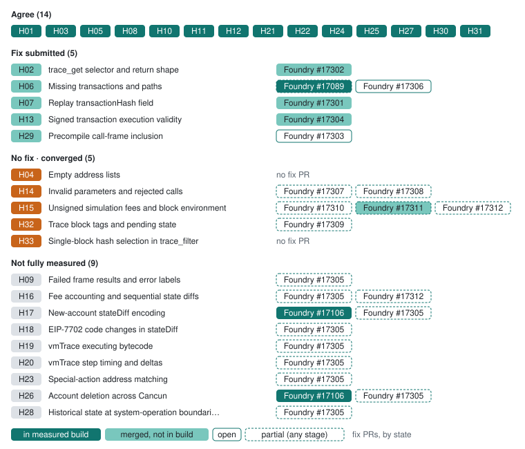

# Anvil: changes to review

Foundry’s development node, captured by replaying each chain instead of through Hive. Foundry 1.8.5 · 51a52c59 ships ten trace-interop fixes (#17301–#17304, #17306, #17307, #17309–#17312): tree-path trace_get, missing blocks and replays, replay transaction hashes, mined traces without nested precompile frames, EIP-3607 rejection for signed raw transactions, conflicting call fields, pending in block trace methods, and the fee-free, cap-only and omitted-gas call environment. With revm-inspectors 0.44.1 (#17226) it also carries the reverted-CREATE results, failure labels and vmTrace fixes. It still accepts integer trace_get indices (open #17308), executes calls priced below the base fee, and cannot set a parent beacon root, so the mined-probes chain is not replayed until open #17305 lands. The nightly e15c2f1c predates the fixes merged on 2026-10-05.

[All clients](../README.md) · [Client fixes](../../docs/client-fixes.md) · [Source guide](../sources.md)

**Progress on 1.8.4-nightly · e15c2f1c** (of 33 decisions): ✅ 17 agree (+3 since the previous capture) · 🛠️ 2 fix submitted · ⚠️ 5 with no fix yet (5 on converged decisions) · ⚪ 9 not fully measured. Upstream fix PRs: 13 merged, 1 open ([client fixes](../../docs/client-fixes.md)).

Each decision on the development build, grouped as in the [progress chart](../README.md#progress), with the client’s fix PRs ([client fixes](../../docs/client-fixes.md)), styled by stage as its legend shows: in the measured development build, merged but not in that build yet, or open, with a dashed edge when a PR covers only part of the decision.

| Tested version | Commit | Commit date (UTC) | Tested (UTC) |
| --- | --- | --- | --- |
| `1.8.5` | [`51a52c59`](https://github.com/foundry-rs/foundry/commit/51a52c59cffd940f76eddd0b4bb1791aa4b5ac7f) | 2026-10-05 | [2026-10-05](../../evidence/2026-10-05/eval/initial/manifest.json) |
| `1.8.4-nightly` | [`e15c2f1c`](https://github.com/foundry-rs/foundry/commit/e15c2f1caf7d8e792295bbfb898280e9cbb8e101) | 2026-10-04 | [2026-10-05](../../evidence/2026-10-05/eval/initial/manifest.json) |

Code links use the tested development sources (or the Geth fork). These are proposed changes for the tested builds. “Checked cases agree” refers to the linked examples, not every behavior of a method. [Test status key](../technical.md#test-status-key).

## Changes to discuss

| Behavior | 1.8.5 · 51a52c59 | 1.8.4-nightly · e15c2f1c | Proposed change |
| --- | --- | --- | --- |
| [Empty address lists](../decisions/H04.md) The linked case differs from the proposed behavior. | ⚠️ Differs [Filter both null](../cases/a/filter-both-null.md) | ⚠️ Differs [Filter both null](../cases/a/filter-both-null.md) | Compare address bytes: OR within each list, AND across lists by default and OR under mode union; missing/null/empty lists are unrestricted. [Address filtering](https://github.com/foundry-rs/foundry/blob/5a99f1a851488fe26863505088e80183ad73cf07/crates/anvil/src/eth/backend/mem/mod.rs#L4223) |
| [Missing transactions and paths](../decisions/H06.md) 1.8.5 · 51a52c59 includes #17306: an unknown block returns -32001 from trace_block and block replays, a trace_filter bound past the head is rejected with -32602 and an unknown replay returns null. The nightly e15c2f1c predates it: trace_block returns `[]` for a missing block and a filter ending past the head returns the head’s records. | ✅ Checked cases agree [Missing block block](../cases/a/missing-block-block.md) | 🛠️ Fix submitted: [Foundry #17306](https://github.com/foundry-rs/foundry/pull/17306) [Missing block block](../cases/a/missing-block-block.md) | None beyond #17306 reaching the nightly. Checked requirements: Unknown transaction returns null, not an empty collection or RPC error. An unknown selected block returns null or an error (-32001 recommended), never a successful collection. A range bound beyond the head returns an error (-32602 recommended), as eth_getLogs does; never a clamped or partial result. [Trace lookup](https://github.com/foundry-rs/foundry/blob/5a99f1a851488fe26863505088e80183ad73cf07/crates/anvil/src/eth/backend/mem/mod.rs#L3858) · [Replay results](https://github.com/foundry-rs/foundry/blob/5a99f1a851488fe26863505088e80183ad73cf07/crates/anvil/src/eth/backend/mem/mod.rs#L3973) |
| [Invalid parameters and rejected calls](../decisions/H14.md) 1.8.5 · 51a52c59 rejects disagreeing `data` and `input` and gasPrice with dynamic fee fields, and prices a legacy blob call by its gasPrice (#17307). Both builds still accept integer trace_get indices, which open #17308 rejects. The nightly e15c2f1c predates #17307. | ⚠️ Differs · [Foundry #17308](https://github.com/foundry-rs/foundry/pull/17308) (partial fix) [Get integer path](../cases/a/get-integer-path.md) | ⚠️ Differs · [Foundry #17307](https://github.com/foundry-rs/foundry/pull/17307) (partial fix) · [Foundry #17308](https://github.com/foundry-rs/foundry/pull/17308) (partial fix) [Get integer path](../cases/a/get-integer-path.md) | Merge #17308: reject integer trace_get indices (-32602 recommended). Checked requirements: Malformed input returns an error (-32602 recommended). Disagreeing data and input are rejected (-32602 recommended). gasPrice with maxFeePerGas or maxPriorityFeePerGas is a fee combination no call can carry, so the call is rejected (-32602 recommended). The blob call runs at GASPRICE 2000000000, the word its CREATE2 child deploys. The blob call runs with type 3, which does not change execution, at GASPRICE 2000000000, the word its CREATE2 child deploys. [Signed transaction replay](https://github.com/foundry-rs/foundry/blob/5a99f1a851488fe26863505088e80183ad73cf07/crates/anvil/src/eth/backend/mem/mod.rs#L4007) · [Call simulation and trace types](https://github.com/foundry-rs/foundry/blob/5a99f1a851488fe26863505088e80183ad73cf07/crates/anvil/src/eth/api.rs#L1500) |
| [Unsigned simulation fees and block environment](../decisions/H15.md) 1.8.5 · 51a52c59 runs fee-free calls at BASEFEE 0 and blob calls without a cap at BLOBBASEFEE 0, accepting an explicit zero cap (#17310), charges cap-only calls at the base fee (#17311) and caps omitted gas by the sender’s allowance (#17312). It still executes a positive gas price or fee cap below the base fee instead of rejecting it. The nightly e15c2f1c predates these fixes. | ⚠️ Differs [Legacy below base/trace/none](../cases/fee-compat/legacy-below-base/trace/none.md) | ⚠️ Differs · [Foundry #17310](https://github.com/foundry-rs/foundry/pull/17310) (partial fix) · [Foundry #17312](https://github.com/foundry-rs/foundry/pull/17312) (partial fix) [Model environment free](../cases/coverage/model-environment-free.md) | Reject a positive gas price or fee cap below the base fee (-32602 or the eth_simulateV1 -38012 recommended), as the native clients do. [Call simulation and trace types](https://github.com/foundry-rs/foundry/blob/5a99f1a851488fe26863505088e80183ad73cf07/crates/anvil/src/eth/api.rs#L1500) |
| [Precompile call-frame inclusion](../decisions/H29.md) 1.8.5 · 51a52c59 omits nested zero-value precompile calls from mined traces (#17303), as simulations and replays do. The nightly e15c2f1c predates it and still returns the calltree’s nested identity call as a frame in trace_transaction, trace_block and trace_filter. | ✅ Checked cases agree [Block 2](../cases/a/block-2.md) | 🛠️ Fix submitted: [Foundry #17303](https://github.com/foundry-rs/foundry/pull/17303) [Block 2](../cases/a/block-2.md) | None beyond #17303 reaching the nightly. Checked requirements: Mined traces follow the same frame policy as simulations: omit the calltree’s nested zero-value identity call. [Mined-trace frame builder](https://github.com/foundry-rs/foundry/blob/5a99f1a851488fe26863505088e80183ad73cf07/crates/anvil/src/eth/backend/mem/storage.rs#L640) |
| [Trace block tags and pending state](../decisions/H32.md) The linked case differs from the proposed behavior. | ⚠️ Differs [Filter earliest](../cases/h30/filter-earliest.md) | ⚠️ Differs · [Foundry #17309](https://github.com/foundry-rs/foundry/pull/17309) (partial fix) [Block pending](../cases/h30/block-pending.md) | The safe tag resolves to the fixture safe head, block 48. The earliest tag resolves like explicit block 0 on this fixture. Accept pending only with a real pending environment, the block after the head; otherwise reject it (-32602 recommended), never evaluating latest instead. [Batched call block default](https://github.com/foundry-rs/foundry/blob/5a99f1a851488fe26863505088e80183ad73cf07/crates/anvil/src/eth/api.rs#L4148) |
| [Single-block hash selection in trace_filter](../decisions/H33.md) Both builds reject every non-null `blockHash` with -32602 through Alloy’s `TraceFilter`, so they pass the error cases and differ wherever block 2’s records are expected. A null `blockHash` beside numeric bounds is rejected too. The reorg scenario does not run on the replica. | ⚠️ Differs [Filter blockhash](../cases/h30/filter-blockhash.md) | ⚠️ Differs [Filter blockhash](../cases/h30/filter-blockhash.md) | Take the Alloy `TraceFilter` member and select exactly the hashed canonical block; treat a null member as omitted. [Address filtering](https://github.com/foundry-rs/foundry/blob/5a99f1a851488fe26863505088e80183ad73cf07/crates/anvil/src/eth/backend/mem/mod.rs#L4223) |

## Open policy observations

These results record behavior whose policy is unresolved. Passing a checked part of a topic does not settle the remaining choices.

| Build | Decision | Observed | Example |
| --- | --- | --- | --- |
| 1.8.5 · 51a52c59 | [Raw-transaction block argument](../decisions/H12.md) | 6 extension cases. Selector block 0x0 by number: honored: the block 0x0 post-state, sender nonce 0. Selector latest: honored: the latest (block 0x30) post-state in the head (block 0x30) environment. Selector block 0x19 by number: honored: the block 0x19 post-state in the block 0x19 environment. Selector block 0x19 by hash: honored: the block 0x19 post-state in the block 0x19 environment. Selector block 0x19 as an EIP-1898 object: honored: the block 0x19 post-state in the block 0x19 environment. Selector pending: honored: the latest (block 0x30) post-state in the pending block 0x31 environment. | [Raw valid](../cases/initial/raw-valid.md) · [Raw state hash](../cases/raw-selector/raw-state-hash.md) |
| 1.8.4-nightly · e15c2f1c | [Raw-transaction block argument](../decisions/H12.md) | 6 extension cases. Selector block 0x0 by number: honored: the block 0x0 post-state, sender nonce 0. Selector latest: honored: the latest (block 0x30) post-state in the head (block 0x30) environment. Selector block 0x19 by number: honored: the block 0x19 post-state in the block 0x19 environment. Selector block 0x19 by hash: honored: the block 0x19 post-state in the block 0x19 environment. Selector block 0x19 as an EIP-1898 object: honored: the block 0x19 post-state in the block 0x19 environment. Selector pending: honored: the latest (block 0x30) post-state in the pending block 0x31 environment. | [Raw valid](../cases/initial/raw-valid.md) · [Raw state hash](../cases/raw-selector/raw-state-hash.md) |

## Assessment gaps

| Decision | Build | Reason | Example |
| --- | --- | --- | --- |
| [Failed frame results and error labels](../decisions/H09.md) | 1.8.5 · 51a52c59 | 12 blocked cases: Replayed chain differs from the fixture at block 0x2 (gasUsed, receiptsRoot). 🟡 Partially assessed · [Foundry #17305](https://github.com/foundry-rs/foundry/pull/17305) (partial fix) | [Block 3](../cases/mined-probes/block-3.md) · [Block 5](../cases/mined-probes/block-5.md) |
| [Failed frame results and error labels](../decisions/H09.md) | 1.8.4-nightly · e15c2f1c | 12 blocked cases: Replayed chain differs from the fixture at block 0x2 (gasUsed, receiptsRoot). 🟡 Partially assessed · [Foundry #17305](https://github.com/foundry-rs/foundry/pull/17305) (partial fix) | [Block 3](../cases/mined-probes/block-3.md) · [Block 5](../cases/mined-probes/block-5.md) |
| [Fee accounting and sequential state diffs](../decisions/H16.md) | 1.8.5 · 51a52c59 | 17 blocked cases: Replayed chain differs from the fixture at block 0x2 (gasUsed, receiptsRoot). 🟡 Partially assessed · [Foundry #17305](https://github.com/foundry-rs/foundry/pull/17305) (partial fix) | [Replay authorizations](../cases/mined-probes/replay-authorizations.md) · [Replay beacon root read](../cases/mined-probes/replay-beacon-root-read.md) |
| [Fee accounting and sequential state diffs](../decisions/H16.md) | 1.8.4-nightly · e15c2f1c | 17 blocked cases: Replayed chain differs from the fixture at block 0x2 (gasUsed, receiptsRoot). 🟡 Partially assessed · [Foundry #17305](https://github.com/foundry-rs/foundry/pull/17305) (partial fix) · [Foundry #17312](https://github.com/foundry-rs/foundry/pull/17312) (partial fix) | [Replay authorizations](../cases/mined-probes/replay-authorizations.md) · [Replay beacon root read](../cases/mined-probes/replay-beacon-root-read.md) |
| [New-account stateDiff encoding](../decisions/H17.md) | 1.8.5 · 51a52c59 | 7 blocked cases: Replayed chain differs from the fixture at block 0x2 (gasUsed, receiptsRoot). 🟡 Partially assessed · [Foundry #17305](https://github.com/foundry-rs/foundry/pull/17305) (partial fix) | [Replay authorizations](../cases/mined-probes/replay-authorizations.md) · [Replay blob transfer](../cases/mined-probes/replay-blob-transfer.md) |
| [New-account stateDiff encoding](../decisions/H17.md) | 1.8.4-nightly · e15c2f1c | 7 blocked cases: Replayed chain differs from the fixture at block 0x2 (gasUsed, receiptsRoot). 🟡 Partially assessed · [Foundry #17305](https://github.com/foundry-rs/foundry/pull/17305) (partial fix) | [Replay authorizations](../cases/mined-probes/replay-authorizations.md) · [Replay blob transfer](../cases/mined-probes/replay-blob-transfer.md) |
| [EIP-7702 code changes in stateDiff](../decisions/H18.md) | 1.8.5 · 51a52c59 | 2 blocked cases: Replayed chain differs from the fixture at block 0x2 (gasUsed, receiptsRoot). 🟡 Partially assessed · [Foundry #17305](https://github.com/foundry-rs/foundry/pull/17305) (partial fix) | [Replay authorizations](../cases/mined-probes/replay-authorizations.md) · [Replay block 6](../cases/mined-probes/replay-block-6.md) |
| [EIP-7702 code changes in stateDiff](../decisions/H18.md) | 1.8.4-nightly · e15c2f1c | 2 blocked cases: Replayed chain differs from the fixture at block 0x2 (gasUsed, receiptsRoot). 🟡 Partially assessed · [Foundry #17305](https://github.com/foundry-rs/foundry/pull/17305) (partial fix) | [Replay authorizations](../cases/mined-probes/replay-authorizations.md) · [Replay block 6](../cases/mined-probes/replay-block-6.md) |
| [vmTrace executing bytecode](../decisions/H19.md) | 1.8.5 · 51a52c59 | 2 blocked cases: Replayed chain differs from the fixture at block 0x2 (gasUsed, receiptsRoot). 🟡 Partially assessed · [Foundry #17305](https://github.com/foundry-rs/foundry/pull/17305) (partial fix) | [Replay refund capped](../cases/mined-probes/replay-refund-capped.md) · [Replay refund clear](../cases/mined-probes/replay-refund-clear.md) |
| [vmTrace executing bytecode](../decisions/H19.md) | 1.8.4-nightly · e15c2f1c | 2 blocked cases: Replayed chain differs from the fixture at block 0x2 (gasUsed, receiptsRoot). 🟡 Partially assessed · [Foundry #17305](https://github.com/foundry-rs/foundry/pull/17305) (partial fix) | [Replay refund capped](../cases/mined-probes/replay-refund-capped.md) · [Replay refund clear](../cases/mined-probes/replay-refund-clear.md) |
| [vmTrace step timing and deltas](../decisions/H20.md) | 1.8.5 · 51a52c59 | 2 blocked cases: Replayed chain differs from the fixture at block 0x2 (gasUsed, receiptsRoot). 🟡 Partially assessed · [Foundry #17305](https://github.com/foundry-rs/foundry/pull/17305) (partial fix) | [Replay refund capped](../cases/mined-probes/replay-refund-capped.md) · [Replay refund clear](../cases/mined-probes/replay-refund-clear.md) |
| [vmTrace step timing and deltas](../decisions/H20.md) | 1.8.4-nightly · e15c2f1c | 2 blocked cases: Replayed chain differs from the fixture at block 0x2 (gasUsed, receiptsRoot). 🟡 Partially assessed · [Foundry #17305](https://github.com/foundry-rs/foundry/pull/17305) (partial fix) | [Replay refund capped](../cases/mined-probes/replay-refund-capped.md) · [Replay refund clear](../cases/mined-probes/replay-refund-clear.md) |
| [Special-action address matching](../decisions/H23.md) | 1.8.5 · 51a52c59 | 9 blocked cases: Replayed chain differs from the fixture at block 0x2 (gasUsed, receiptsRoot). 3 blocked cases: The H04 list semantics differ, so the special-action records cannot be judged separately. 🟡 Partially assessed · [Foundry #17305](https://github.com/foundry-rs/foundry/pull/17305) (partial fix) | [Filter both null](../cases/a/filter-both-null.md) · [Filter from null](../cases/a/filter-from-null.md) |
| [Special-action address matching](../decisions/H23.md) | 1.8.4-nightly · e15c2f1c | 9 blocked cases: Replayed chain differs from the fixture at block 0x2 (gasUsed, receiptsRoot). 3 blocked cases: The H04 list semantics differ, so the special-action records cannot be judged separately. 🟡 Partially assessed · [Foundry #17305](https://github.com/foundry-rs/foundry/pull/17305) (partial fix) | [Filter both null](../cases/a/filter-both-null.md) · [Filter from null](../cases/a/filter-from-null.md) |
| [Account deletion across Cancun](../decisions/H26.md) | 1.8.5 · 51a52c59 | 8 blocked cases: Replayed chain differs from the fixture at block 0x2 (gasUsed, receiptsRoot). 🟡 Partially assessed · [Foundry #17305](https://github.com/foundry-rs/foundry/pull/17305) (partial fix) | [Block 4](../cases/mined-probes/block-4.md) · [Replay block 4](../cases/mined-probes/replay-block-4.md) |
| [Account deletion across Cancun](../decisions/H26.md) | 1.8.4-nightly · e15c2f1c | 8 blocked cases: Replayed chain differs from the fixture at block 0x2 (gasUsed, receiptsRoot). 🟡 Partially assessed · [Foundry #17305](https://github.com/foundry-rs/foundry/pull/17305) (partial fix) | [Block 4](../cases/mined-probes/block-4.md) · [Replay block 4](../cases/mined-probes/replay-block-4.md) |
| [Historical state at system-operation boundaries](../decisions/H28.md) | 1.8.5 · 51a52c59 | 6 blocked cases: Replayed chain differs from the fixture at block 0x2 (gasUsed, receiptsRoot). | [Block 2](../cases/mined-probes/block-2.md) · [Replay beacon root read](../cases/mined-probes/replay-beacon-root-read.md) |
| [Historical state at system-operation boundaries](../decisions/H28.md) | 1.8.4-nightly · e15c2f1c | 6 blocked cases: Replayed chain differs from the fixture at block 0x2 (gasUsed, receiptsRoot). | [Block 2](../cases/mined-probes/block-2.md) · [Replay beacon root read](../cases/mined-probes/replay-beacon-root-read.md) |

✅ Behaviors with no difference in the checked cases

| Behavior | Examples |
| --- | --- |
| [trace_get selector and return shape](../decisions/H02.md) | [_reference/block/0x30](../cases/a/_reference/block/0x30.md) · [Block 2](../cases/a/block-2.md) |
| [Filter composition and mode](../decisions/H03.md) | [Filter all](../cases/a/filter-all.md) · [Filter both unknown mode](../cases/a/filter-both-unknown-mode.md) |
| [Post-merge reward records](../decisions/H05.md) | [_reference/block/0x30](../cases/a/_reference/block/0x30.md) · [Block 2](../cases/a/block-2.md) |
| [Replay transactionHash field](../decisions/H07.md) | [Replay 7702 statediff](../cases/initial/replay-7702-stateDiff.md) · [Replay 7702 trace](../cases/initial/replay-7702-trace.md) |
| [Empty output and unrequested components](../decisions/H08.md) | [Auth clear](../cases/a/auth-clear.md) · [Auth replace](../cases/a/auth-replace.md) |
| [Creation result field names](../decisions/H10.md) | [Call mixed create](../cases/a/call-mixed-create.md) · [Model empty runtime](../cases/coverage/model-empty-runtime.md) |
| [Empty trace-type selection](../decisions/H11.md) | [Empty types](../cases/a/empty-types.md) · [Call empty types](../cases/initial/call-empty-types.md) |
| [Raw-transaction block argument](../decisions/H12.md) | [Raw valid](../cases/initial/raw-valid.md) · [Raw state hash](../cases/raw-selector/raw-state-hash.md) |
| [Signed transaction execution validity](../decisions/H13.md) | [Raw below basefee](../cases/a/raw-below-basefee.md) · [Raw insufficient funds](../cases/a/raw-insufficient-funds.md) |
| [vmTrace numeric and optional metadata encoding](../decisions/H21.md) | [Auth clear](../cases/a/auth-clear.md) · [Auth replace](../cases/a/auth-replace.md) |
| [Precompile return bytes](../decisions/H22.md) | [Call identity](../cases/initial/call-identity.md) |
| [Sibling failure isolation](../decisions/H24.md) | [Call siblings revert ok](../cases/a/call-siblings-revert-ok.md) · [Nested call outer0 value1 failed](../cases/precompile-values/nested-call-outer0-value1-failed.md) |
| [Well-formed errors for rejected raw transactions](../decisions/H25.md) | [Auth clear](../cases/a/auth-clear.md) · [Auth replace](../cases/a/auth-replace.md) |
| [Filter execution across fork boundaries](../decisions/H27.md) | [Filter two blocks](../cases/a/filter-two-blocks.md) · [_reference/block/0x30](../cases/a/_reference/block/0x30.md) |
| [Omitted trace_filter range bounds](../decisions/H30.md) | [Filter no bounds](../cases/h30/filter-no-bounds.md) · [Filter to 2 implicit from](../cases/h30/filter-to-2-implicit-from.md) |
| [Omitted trace_callMany block](../decisions/H31.md) | [Call number default](../cases/h30/call-number-default.md) · [Call number latest](../cases/h30/call-number-latest.md) |

[Method availability](../decisions/H01.md) · [All decisions](../../decisions/README.md)

For setup gaps, exact run inventories and reproduction, see the [technical appendix](../technical.md).
