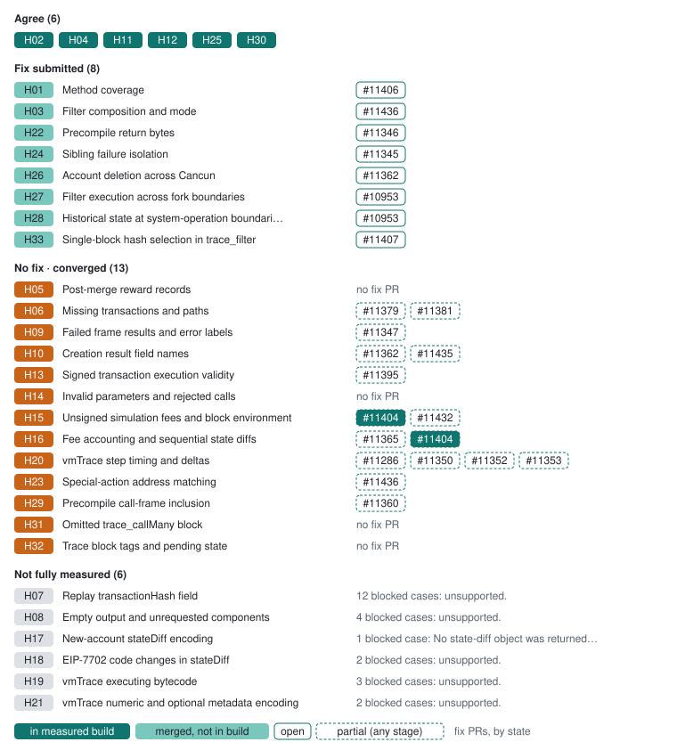

# Besu: changes to review

Start with failed-frame reporting, precompile output and inclusion, and range-filter consistency. Individual replay also needs a scope decision. 26.10-develop · 711f8142 runs unsigned calls like eth_call (#11404) and returns rejected trace_callMany bundles as one JSON-RPC error (#11401); trace_callMany still lacks a per-call transaction boundary (#11365) and answers every rejected item with an internal error.

[All clients](../README.md) · [Client fixes](../../docs/client-fixes.md) · [Source guide](../sources.md)

**Progress on 26.10-develop · 711f8142** (of 33 decisions): ✅ 6 agree (+2 since the previous capture) · 🛠️ 10 fix submitted · ⚠️ 11 with no fix yet (11 on converged decisions) · ⚪ 6 not fully measured. 2 of these agreements are not yet in 26.9.0 · ee9c64c8. Upstream fix PRs: 2 merged, 22 open ([client fixes](../../docs/client-fixes.md)).

Each decision on the development build, grouped as in the [progress chart](../README.md#progress), with the client’s fix PRs ([client fixes](../../docs/client-fixes.md)), styled by stage as its legend shows: in the measured development build, merged but not in that build yet, or open, with a dashed edge when a PR covers only part of the decision.

| Tested version | Commit | Commit date (UTC) | Tested (UTC) |
| --- | --- | --- | --- |
| `26.9.0` | [`ee9c64c8`](https://github.com/besu-eth/besu/commit/ee9c64c8ed031cba5c6bcdb502a79c03c3a467c4) | 2026-09-22 | [2026-10-02](../../evidence/2026-10-02/eval/initial/manifest.json) [2026-10-03](../../evidence/2026-10-03/fee-combos/probes-prague/manifest.json) |
| `26.10-develop` | [`711f8142`](https://github.com/besu-eth/besu/commit/711f8142eb12750a1777ef366e0e0eeeca69513d) | 2026-10-02 | [2026-10-02](../../evidence/2026-10-02/eval/initial/manifest.json) [2026-10-03](../../evidence/2026-10-03/fee-combos/probes-prague/manifest.json) |

Code links use the tested development sources (or the Geth fork). These are proposed changes for the tested builds. “Checked cases agree” refers to the linked examples, not every behavior of a method. [Test status key](../technical.md#test-status-key).

## Changes to discuss

| Behavior | 26.9.0 · ee9c64c8 | 26.10-develop · 711f8142 | Proposed change |
| --- | --- | --- | --- |
| [Method coverage](../decisions/H01.md) Individual transaction replay is unavailable. | 🛠️ Fix submitted: [Besu #11406](https://github.com/besu-eth/besu/pull/11406) [Replay 7702 statediff](../cases/initial/replay-7702-stateDiff.md) | 🛠️ Fix submitted: [Besu #11406](https://github.com/besu-eth/besu/pull/11406) [Replay 7702 statediff](../cases/initial/replay-7702-stateDiff.md) | Add `trace_replayTransaction`; the draft requires all nine methods. Checked requirements: trace_replayTransaction [Block replay](https://github.com/besu-eth/besu/blob/f9572aa82a2dadb3dd1b218d3ca97101540faf97/ethereum/api/src/main/java/org/hyperledger/besu/ethereum/api/jsonrpc/internal/methods/TraceReplayBlockTransactions.java#L58) |
| [Filter composition and mode](../decisions/H03.md) A recipient-only filter returns 1 of the 2 expected calls. Every recognized `mode` value is rejected with `-32602`, including `intersection` and `union`. | 🛠️ Fix submitted: [Besu #11436](https://github.com/besu-eth/besu/pull/11436) [Filter from only intersection](../cases/a/filter-from-only-intersection.md) | 🛠️ Fix submitted: [Besu #11436](https://github.com/besu-eth/besu/pull/11436) [Filter from only intersection](../cases/a/filter-from-only-intersection.md) | Make a one-sided query select every call matching the populated list. Accept `intersection` as the default and `union` as an explicit option; reject only unknown values. [Filter execution pipeline](https://github.com/besu-eth/besu/blob/f9572aa82a2dadb3dd1b218d3ca97101540faf97/ethereum/api/src/main/java/org/hyperledger/besu/ethereum/api/jsonrpc/internal/methods/TraceFilter.java#L135) |
| [Post-merge reward records](../decisions/H05.md) PoS blocks include a synthetic PoW reward record. | ⚠️ Differs [_reference/block/0x30](../cases/a/_reference/block/0x30.md) | ⚠️ Differs [_reference/block/0x30](../cases/a/_reference/block/0x30.md) | Remove the placeholder reward. This also changes which records pagination counts. Checked requirements: A PoS block has no synthetic PoW reward records. The declared PoS range contains no synthetic PoW reward records, including withdrawal blocks. A range from genesis contributes no genesis reward; blocks 1 and 2 contribute their block rewards. [Filter execution pipeline](https://github.com/besu-eth/besu/blob/f9572aa82a2dadb3dd1b218d3ca97101540faf97/ethereum/api/src/main/java/org/hyperledger/besu/ethereum/api/jsonrpc/internal/methods/TraceFilter.java#L135) · [Call-frame inclusion](https://github.com/besu-eth/besu/blob/f9572aa82a2dadb3dd1b218d3ca97101540faf97/ethereum/api/src/main/java/org/hyperledger/besu/ethereum/api/jsonrpc/internal/results/tracing/flat/FlatTraceGenerator.java#L284) |
| [Missing transactions and paths](../decisions/H06.md) Unknown transactions can return [] and an unknown selected block returns null. | ⚠️ Differs · [Besu #11379](https://github.com/besu-eth/besu/pull/11379) (partial fix) · [Besu #11381](https://github.com/besu-eth/besu/pull/11381) (partial fix) 1 blocked case: unsupported. [Transaction missing](../cases/initial/transaction-missing.md) | ⚠️ Differs · [Besu #11379](https://github.com/besu-eth/besu/pull/11379) (partial fix) · [Besu #11381](https://github.com/besu-eth/besu/pull/11381) (partial fix) 1 blocked case: unsupported. [Transaction missing](../cases/initial/transaction-missing.md) | Return `null` for an unknown transaction, so callers can distinguish absence from a transaction with no call records. Filter bounds beyond the head already return `-32602` as proposed. Checked requirements: Unknown transaction returns null, not an empty collection or RPC error. [Trace lookup](https://github.com/besu-eth/besu/blob/f9572aa82a2dadb3dd1b218d3ca97101540faf97/ethereum/api/src/main/java/org/hyperledger/besu/ethereum/api/jsonrpc/internal/methods/TraceGet.java#L37) · [Block replay](https://github.com/besu-eth/besu/blob/f9572aa82a2dadb3dd1b218d3ca97101540faf97/ethereum/api/src/main/java/org/hyperledger/besu/ethereum/api/jsonrpc/internal/methods/TraceReplayBlockTransactions.java#L58) |
| [Failed frame results and error labels](../decisions/H09.md) Failed frames lose result information; a failed root precompile can also lack an error. | ⚠️ Differs · [Besu #11347](https://github.com/besu-eth/besu/pull/11347) (partial fix) 1 blocked case: Address selection differs from its reference; failure-bearing frame selection is not established. 1 blocked case: H25 owns this error, an error envelope returned as a successful result. There is no executed result to inspect. 1 blocked case: No failed attempts ['call', 'create'] under the deepest executed frame at depth 1025. 1 blocked case: No frame matches {'action': {'value': '0x1'}, 'traceAddress': [0], 'type': 'call'}. 1 blocked case: No frame matches {'action': {'value': '0x1'}, 'traceAddress': [0], 'type': 'create'}. 2 blocked cases: The RPC returned an error, so there is no execution result to inspect. 6 blocked cases: unsupported. [Auth replace](../cases/a/auth-replace.md) | ⚠️ Differs · [Besu #11347](https://github.com/besu-eth/besu/pull/11347) (partial fix) 1 blocked case: Address selection differs from its reference; failure-bearing frame selection is not established. 1 blocked case: No failed attempts ['call', 'create'] under the deepest executed frame at depth 1025. 1 blocked case: No frame matches {'action': {'value': '0x1'}, 'traceAddress': [0], 'type': 'call'}. 1 blocked case: No frame matches {'action': {'value': '0x1'}, 'traceAddress': [0], 'type': 'create'}. 1 blocked case: The RPC returned an error, so there is no execution result to inspect. 6 blocked cases: unsupported. [Auth replace](../cases/a/auth-replace.md) | Keep the error on the failing frame, including a failed root precompile. Add `result: {gasUsed, output}` to REVERT frames; exceptional halts may keep omitting `result`. Use the listed labels, e.g. "Mutable Call In Static Context" and "Built-in failed". `revertReason` is outside the format and may stay as an extension once `result` is present. Checked requirements: A REVERT frame keeps result {gasUsed, output}; a reverted CREATE has no address or code. The fixture REVERT frame preserves its exact return bytes and opcode gas, regardless of error wording. A failed root precompile reports its own execution error. The modelled REVERT root retains its exact return bytes and independently calculated execution gas. A CREATE2 address collision frame has error "Contract address collision". A reverted nested CREATE has error "Reverted" and result {gasUsed, output} with its revert bytes and execution gas, without address or code. Code above the EIP-170 size limit fails the creation with "Out of gas", as Parity and EIP-170 report it. Code beginning with 0xEF (EIP-3541) fails the creation with "Invalid code", as OpenEthereum reports it. A reverted CREATE reports error Reverted and result {gasUsed, output} with its revert bytes and no address or code; root action.gas excludes intrinsic gas. A reverted nested CREATE reports error Reverted and result {gasUsed, output} without address or code. Replay output carries the revert bytes. [Call-frame inclusion](https://github.com/besu-eth/besu/blob/f9572aa82a2dadb3dd1b218d3ca97101540faf97/ethereum/api/src/main/java/org/hyperledger/besu/ethereum/api/jsonrpc/internal/results/tracing/flat/FlatTraceGenerator.java#L284) |
| [Creation result field names](../decisions/H10.md) A successful creation reports deployed bytecode under `output`, and `creationMethod` is missing from most create frames and computed per transaction. | ⚠️ Differs · [Besu #11362](https://github.com/besu-eth/besu/pull/11362) (partial fix) · [Besu #11435](https://github.com/besu-eth/besu/pull/11435) (partial fix) [Block tree](../cases/initial/block-tree.md) | ⚠️ Differs · [Besu #11362](https://github.com/besu-eth/besu/pull/11362) (partial fix) · [Besu #11435](https://github.com/besu-eth/besu/pull/11435) (partial fix) [Block tree](../cases/initial/block-tree.md) | Use `code` for deployed bytecode, alongside `address` and `gasUsed`. Emit `creationMethod` on every create action, from that frame’s own opcode. Checked requirements: The creation fixture contains its CREATE frame and successful creations include address, code and gasUsed. Successful creation uses address, code and gasUsed. [Call-frame inclusion](https://github.com/besu-eth/besu/blob/f9572aa82a2dadb3dd1b218d3ca97101540faf97/ethereum/api/src/main/java/org/hyperledger/besu/ethereum/api/jsonrpc/internal/results/tracing/flat/FlatTraceGenerator.java#L284) |
| [Empty trace-type selection](../decisions/H11.md) 26.9.0 · ee9c64c8 rejects the zero-fee call with an empty trace selection, an H15 fee rejection. 26.10-develop · 711f8142 includes #11404, executes it and returns the output with the unrequested components empty, so the empty selection needed no separate fix. | ⚠️ Differs [Call empty types](../cases/initial/call-empty-types.md) | ✅ Checked cases agree [Empty types](../cases/a/empty-types.md) | Ship #11404 in a release. Checked requirements: An empty trace-type selection executes and preserves the fixture return bytes. [Call simulation](https://github.com/besu-eth/besu/blob/f9572aa82a2dadb3dd1b218d3ca97101540faf97/ethereum/api/src/main/java/org/hyperledger/besu/ethereum/api/jsonrpc/internal/methods/AbstractTraceCall.java#L40) |
| [Signed transaction execution validity](../decisions/H13.md) Marker probes execute wrong-chain and ordinary-code-sender transactions. Nonce, funds, intrinsic-gas and base-fee failures instead return empty success-shaped traces; these do not prove execution. | ⚠️ Differs · [Besu #11395](https://github.com/besu-eth/besu/pull/11395) (partial fix) [Raw below basefee](../cases/a/raw-below-basefee.md) | ⚠️ Differs · [Besu #11395](https://github.com/besu-eth/besu/pull/11395) (partial fix) [Raw below basefee](../cases/a/raw-below-basefee.md) | Apply selected-state execution validity before running signed transactions. Distinguish validation rejection from execution failure, and reject each invalid transaction for its own violation; the eth_sendRawTransaction error-group codes (1, 2, 800, 804, 806, 809), falling back to -32003, are recommended. Checked requirements: Reject a signed transaction that fails execution validity at the selected state before EVM execution, for its own violation. [Signed transaction replay](https://github.com/besu-eth/besu/blob/f9572aa82a2dadb3dd1b218d3ca97101540faf97/ethereum/api/src/main/java/org/hyperledger/besu/ethereum/api/jsonrpc/internal/methods/TraceRawTransaction.java#L46) |
| [Invalid parameters and rejected calls](../decisions/H14.md) Wrong address-list types and negative count can return results rather than invalid params. | ⚠️ Differs · [Besu #11432](https://github.com/besu-eth/besu/pull/11432) (partial fix) · [Besu #11439](https://github.com/besu-eth/besu/pull/11439) (partial fix) 2 blocked cases: Depends on H15: The zero-address sender is unfunded, so the call runs only if its fees are zero; an error rejects the fee, not the from default. Observed rpc_error -32603 Internal error. [Filter negative count](../cases/a/filter-negative-count.md) | ⚠️ Differs · [Besu #11432](https://github.com/besu-eth/besu/pull/11432) (partial fix) · [Besu #11439](https://github.com/besu-eth/besu/pull/11439) (partial fix) [Filter negative count](../cases/a/filter-negative-count.md) | Validate filter types and bounds and reject invalid request shapes (-32602 recommended). Checked requirements: Malformed input returns an error (-32602 recommended). A legacy gasPrice with an authorizationList is accepted and priced as both fee caps; the valid authorization still delegates key 1 to the marker contract, which returns word 42. A chainId that does not match the chain rejects the request; it is invalid regardless of state (-32602 recommended). gasPrice with maxFeePerGas or maxPriorityFeePerGas is a fee combination no call can carry, so the call is rejected (-32602 recommended). The call runs with type 4, which does not change execution, with its authorization applied, so the delegated marker returns word 42. Null mode, after, count and address lists are omitted, so blocks 2-5 return every record. The access-list fields at block 31, before Berlin (block 32) name a feature not active at the selected block, so the call is rejected (-32003 recommended). The dynamic-fees fields at block 35, before London (block 36) name a feature not active at the selected block, so the call is rejected (-32003 recommended). The dynamic-fees fields run at block 36, at London (block 36). The blob fields at block 55, before Cancun (block 56) name a feature not active at the selected block, so the call is rejected (-32003 recommended). The blob fields run at block 56, at Cancun (block 56). The authorization fields at block 59, before Prague (block 60) name a feature not active at the selected block, so the call is rejected (-32003 recommended). The authorization fields run at block 60, at Prague (block 60). Dynamic fee fields at block 35, before London (block 36), name a feature not active at the selected block, so the call is rejected (-32003 recommended), never run with the fees ignored or reinterpreted. The blob call runs at GASPRICE 2000000000, the word its CREATE2 child deploys. [Signed transaction replay](https://github.com/besu-eth/besu/blob/f9572aa82a2dadb3dd1b218d3ca97101540faf97/ethereum/api/src/main/java/org/hyperledger/besu/ethereum/api/jsonrpc/internal/methods/TraceRawTransaction.java#L46) · [Call simulation](https://github.com/besu-eth/besu/blob/f9572aa82a2dadb3dd1b218d3ca97101540faf97/ethereum/api/src/main/java/org/hyperledger/besu/ethereum/api/jsonrpc/internal/methods/AbstractTraceCall.java#L40) |
| [Unsigned simulation fees and block environment](../decisions/H15.md) 26.9.0 · ee9c64c8: paired eth_call executes explicit zero fees with BASEFEE 0, while trace_call returns an internal error; an omitted fee is priced and charged at the base fee in trace_call but free in eth_call, and invalid trace fee/funding requests produce generic internal errors. 26.10-develop · 711f8142 includes #11404: trace_call and every trace_callMany item run an unpriced call like eth_call (GASPRICE and BASEFEE 0, no fee effects) and validate and charge a priced one. Its trace_call names each rejection with Besu’s own codes (-32009 below the base fee, -32004 insufficient funds, -32003 intrinsic gas) instead of the eth_simulateV1 codes, and reports a positive tip over a zero or omitted fee cap as below the base fee instead of as a priority fee above the cap. trace_callMany answers every rejected item, whatever the violation, with -32603 Internal error, so 152 rejection checks are unassessable. Both builds reject a supplied nonce below the state nonce, 26.9.0 with -32603 and the development build with -32001 (“Nonce too low”). On blob calls an omitted or zero `maxFeePerBlobGas` runs at the head’s BLOBBASEFEE (1) instead of 0; the development build accepts the explicit zero, which 26.9.0 rejects with an internal error. | ⚠️ Differs · [Besu #11404](https://github.com/besu-eth/besu/pull/11404) (partial fix) · [Besu #11432](https://github.com/besu-eth/besu/pull/11432) (partial fix) 224 blocked cases: A generic/internal/crash error does not prove validation: internal error. 1 blocked case: Depends on H15: The client may reject its default gas budget for insufficient funds; gas defaulting requires a successful eth_call control. Observed result -32603 Internal error. 1 blocked case: Depends on H15: The client may reject its default gas budget for insufficient funds; gas defaulting requires a successful eth_call control. Observed rpc_error -32004 Upfront gas cost exceeds account balance (transaction up-front gas cost 0x1b1ae4d6e2ef500000 exceeds transaction sender. 1 blocked case: Depends on H15: The client may reject its default gas budget for insufficient funds; gas defaulting requires a successful eth_call control. Observed rpc_error -32603 Internal error. 2 blocked cases: No receipt gas or execution-gas witness was captured. 1 blocked case: The refund is not independently derived; balances settle within the refund bound. Gas=120918..151147 (root execution gas plus independently calculated Prague intrinsic/floor cost, less any refund), price=2000000000, expected tip=1998322570/gas, burn=1677430/gas, blob fee and destroyed wei=0. 4 blocked cases: The refund is not independently derived; balances settle within the refund bound. Gas=21000..23137 (root execution gas plus independently calculated Prague intrinsic/floor cost, less any refund), price=2000000000, expected tip=1998322570/gas, burn=1677430/gas, blob fee and destroyed wei=0. 4 blocked cases: The refund is not independently derived; balances settle within the refund bound. Gas=34829..43536 (root execution gas plus independently calculated Prague intrinsic/floor cost, less any refund), price=2000000000, expected tip=1998322570/gas, burn=1677430/gas, blob fee and destroyed wei=0. 56 blocked cases: eth_call: base_fee rejection; trace_call: unclassified RPC error: internal error. 56 blocked cases: eth_call: execution output (224 bytes); trace_call: unclassified RPC error: internal error. 48 blocked cases: eth_call: funds rejection; trace_call: unclassified RPC error: internal error. 8 blocked cases: eth_call: priority rejection; trace_call: unclassified RPC error: internal error. [Model environment free](../cases/coverage/model-environment-free.md) | ⚠️ Differs · [Besu #11432](https://github.com/besu-eth/besu/pull/11432) (partial fix) 152 blocked cases: A generic/internal/crash error does not prove validation: internal error. 2 blocked cases: Depends on H15: The client may reject its default gas budget for insufficient funds; gas defaulting requires a successful eth_call control. Observed rpc_error -32004 Upfront gas cost exceeds account balance (transaction up-front gas cost 0x1b1ae4d6e2ef500000 exceeds transaction sender. 1 blocked case: Depends on H15: The client may reject its default gas budget for insufficient funds; gas defaulting requires a successful eth_call control. Observed rpc_error -32603 Internal error. 2 blocked cases: No receipt gas or execution-gas witness was captured. 1 blocked case: The refund is not independently derived; balances settle within the refund bound. Gas=120918..151147 (root execution gas plus independently calculated Prague intrinsic/floor cost, less any refund), price=2000000000, expected tip=1998322570/gas, burn=1677430/gas, blob fee and destroyed wei=0. 4 blocked cases: The refund is not independently derived; balances settle within the refund bound. Gas=21000..23137 (root execution gas plus independently calculated Prague intrinsic/floor cost, less any refund), price=2000000000, expected tip=1998322570/gas, burn=1677430/gas, blob fee and destroyed wei=0. 4 blocked cases: The refund is not independently derived; balances settle within the refund bound. Gas=34829..43536 (root execution gas plus independently calculated Prague intrinsic/floor cost, less any refund), price=2000000000, expected tip=1998322570/gas, burn=1677430/gas, blob fee and destroyed wei=0. [Defaults tip only positive/trace/none](../cases/fee-compat/defaults-tip-only-positive/trace/none.md) | Ship #11404 in a release. Report each rejected trace_callMany item with its own reason, as trace_call does, with the eth_simulateV1 codes recommended (-38012, -38014, -38013); rank a tip above the cap ahead of the base-fee check (-32602 recommended); ignore a supplied nonce. Run a blob call with an omitted or zero `maxFeePerBlobGas` at BLOBBASEFEE 0 with no blob fee. [Call simulation](https://github.com/besu-eth/besu/blob/f9572aa82a2dadb3dd1b218d3ca97101540faf97/ethereum/api/src/main/java/org/hyperledger/besu/ethereum/api/jsonrpc/internal/methods/AbstractTraceCall.java#L40) |
| [Fee accounting and sequential state diffs](../decisions/H16.md) `trace_callMany` does not start each call at a transaction boundary, so a later call’s SSTORE uses the pre-bundle original value of a slot an earlier call wrote. With the zero-fee bundles executing since #11404, 26.10-develop · 711f8142 shows it in both bundles: the second `initial/call-many` and `initial/call-many-priced` call uses 5,600 gas less (0x1e683 against 0x1fc63) than on every other build, `probes-prague/many-original-value` measures a 2,208-gas SSTORE where 5,008 is expected (2,800 less), and the reverted write in `a/many-storage-write-revert-read` is charged 2,800 gas less. Transient storage, warm sets and SELFDESTRUCT scope already reset per call. A rejected item returns -32603 Internal error (`field-gas-omitted-allowance-many`) rather than its funds rejection. | ⚠️ Differs · [Besu #11365](https://github.com/besu-eth/besu/pull/11365) (partial fix) · [Besu #11404](https://github.com/besu-eth/besu/pull/11404) (partial fix) 258 blocked cases: H25 owns this error, an error envelope returned as a successful result. There is no executed result to inspect. 12 blocked cases: unsupported. [Raw valid default block](../cases/initial/raw-valid-default-block.md) | ⚠️ Differs · [Besu #11365](https://github.com/besu-eth/besu/pull/11365) (partial fix) 12 blocked cases: unsupported. [Raw valid default block](../cases/initial/raw-valid-default-block.md) | Mark a transaction boundary before each call, as block replay already does, so original values, access sets, transient storage and refunds start afresh (#11365). Return a rejected item’s own error (H15). Checked requirements: The declared state-diff fixture returns the requested account changes. Each item snapshots original storage: a slot committed by the previous item is clean and cold (5000 gas), not dirty. Account balance deltas conserve transferred value, pay the exact miner tip and burn the selected block base fee, blob fee and any wei a same-transaction SELFDESTRUCT destroys. Return one execution envelope per input call, in order. [Call simulation](https://github.com/besu-eth/besu/blob/f9572aa82a2dadb3dd1b218d3ca97101540faf97/ethereum/api/src/main/java/org/hyperledger/besu/ethereum/api/jsonrpc/internal/methods/AbstractTraceCall.java#L40) · [State differences](https://github.com/besu-eth/besu/blob/f9572aa82a2dadb3dd1b218d3ca97101540faf97/ethereum/api/src/main/java/org/hyperledger/besu/ethereum/api/jsonrpc/internal/results/tracing/diff/StateTraceGenerator.java#L148) |
| [vmTrace step timing and deltas](../decisions/H20.md) The `MCOPY` step omits its memory write, and CALL-family `mem` can copy the calling frame’s final RETURN. A value CALL’s `cost` includes the stipend and a precompile CALL’s the precompile cost; a CALL or CREATE that fails its precheck reports its net cost and a `sub`; a halted operation keeps a bogus `ex`. | ⚠️ Differs · [Besu #11286](https://github.com/besu-eth/besu/pull/11286) (partial fix) · [Besu #11350](https://github.com/besu-eth/besu/pull/11350) (partial fix) · [Besu #11352](https://github.com/besu-eth/besu/pull/11352) (partial fix) · [Besu #11353](https://github.com/besu-eth/besu/pull/11353) (partial fix) 3 blocked cases: The RPC returned an error, so there is no execution result to inspect. 4 blocked cases: unsupported. [Call mcopy](../cases/a/call-mcopy.md) | ⚠️ Differs · [Besu #11286](https://github.com/besu-eth/besu/pull/11286) (partial fix) · [Besu #11350](https://github.com/besu-eth/besu/pull/11350) (partial fix) · [Besu #11352](https://github.com/besu-eth/besu/pull/11352) (partial fix) · [Besu #11353](https://github.com/besu-eth/besu/pull/11353) (partial fix) 4 blocked cases: unsupported. [Call mcopy](../cases/a/call-mcopy.md) | Include the bytes written at offset 32 in the MCOPY step’s memory delta, and stop copying the caller’s final RETURN into CALL-family `mem` (the copied bytes then conform). Exclude the stipend from value-CALL `cost`, include forwarded gas in precompile-call and failed-precheck `cost`, give a failed-precheck operation `sub: null`, and report a halted operation with `ex: null`. Checked requirements: At every VM depth, every pc lies inside the code, PUSH matches bytecode, each step deducts its cost and a call or creation also receives its child leftover or, entering no frame, includes the gas it forwarded, subtraces appear only on calls and creations, MLOAD mem is its loaded word, call mem is the output window or the copied return data, and RETURN/REVERT report no mem. MCOPY reports its same-step write of word 42 at offset 32. The independently executable replay/raw root has exact costs, post-step gas, stack and memory effects. Every modelled step has exact opcode cost, post-step gas, stack effects, memory writes and storage effects. The CALL whose precheck failed has sub null; the sibling that entered a frame has a sub. The CREATE whose precheck failed has sub null; the sibling that entered a frame has a sub. [VM memory deltas](https://github.com/besu-eth/besu/blob/f9572aa82a2dadb3dd1b218d3ca97101540faf97/ethereum/api/src/main/java/org/hyperledger/besu/ethereum/api/jsonrpc/internal/results/tracing/vm/VmTraceGenerator.java#L230) |
| [Precompile return bytes](../decisions/H22.md) The identity precompile returns bytes in the execution envelope but not its call frame. | 🛠️ Fix submitted: [Besu #11346](https://github.com/besu-eth/besu/pull/11346) [Call identity](../cases/initial/call-identity.md) | 🛠️ Fix submitted: [Besu #11346](https://github.com/besu-eth/besu/pull/11346) [Call identity](../cases/initial/call-identity.md) | Copy the precompile’s return bytes into the call-frame result as well. Checked requirements: The identity precompile call frame preserves its input as return bytes. [Call-frame inclusion](https://github.com/besu-eth/besu/blob/f9572aa82a2dadb3dd1b218d3ca97101540faf97/ethereum/api/src/main/java/org/hyperledger/besu/ethereum/api/jsonrpc/internal/results/tracing/flat/FlatTraceGenerator.java#L284) |
| [Special-action address matching](../decisions/H23.md) CREATE and SELFDESTRUCT address queries disagree with the corresponding block trace. | ⚠️ Differs · [Besu #11436](https://github.com/besu-eth/besu/pull/11436) (partial fix) 1 blocked case: Depends on H03: The request names the default mode explicitly, so a server that rejects the mode field fails before matching rewards. Observed rpc_error -32602 Invalid filter params. 5 blocked cases: The H03 list semantics differ, so the special-action records cannot be judged separately. 1 blocked case: The RPC returned an error, so there is no execution result to inspect. [Filter created to](../cases/a/filter-created-to.md) | ⚠️ Differs · [Besu #11436](https://github.com/besu-eth/besu/pull/11436) (partial fix) 1 blocked case: Depends on H03: The request names the default mode explicitly, so a server that rejects the mode field fails before matching rewards. Observed rpc_error -32602 Invalid filter params. 5 blocked cases: The H03 list semantics differ, so the special-action records cannot be judged separately. 1 blocked case: The RPC returned an error, so there is no execution result to inspect. [Filter created to](../cases/a/filter-created-to.md) | Match creation by creator/created address, SELFDESTRUCT by executing account/beneficiary, and rewards by `author` on the recipient side. Checked requirements: A CREATE, SELFDESTRUCT or reward record matches the lists by its own from/to equivalents. Compare address bytes: OR within each list, AND across lists by default and OR under mode union; missing/null/empty lists are unrestricted. A reward matches toAddress by author, after its block's transactions: block reward, then uncle rewards in ommer order. In union mode a toAddress match by author suffices for a reward; sender roots precede their block's rewards. A created-then-destroyed address matches its creation and its SELFDESTRUCT beneficiary. A SELFDESTRUCT matches fromAddress by its executing account. A SELFDESTRUCT to self also matches toAddress as its own beneficiary. [Filter execution pipeline](https://github.com/besu-eth/besu/blob/f9572aa82a2dadb3dd1b218d3ca97101540faf97/ethereum/api/src/main/java/org/hyperledger/besu/ethereum/api/jsonrpc/internal/methods/TraceFilter.java#L135) |
| [Sibling failure isolation](../decisions/H24.md) A handled child failure can mark a successful parent or sibling as failed. | 🛠️ Fix submitted: [Besu #11345](https://github.com/besu-eth/besu/pull/11345) [Call siblings revert ok](../cases/a/call-siblings-revert-ok.md) | 🛠️ Fix submitted: [Besu #11345](https://github.com/besu-eth/besu/pull/11345) [Call siblings revert ok](../cases/a/call-siblings-revert-ok.md) | Track errors per frame; a caught failure must not change the outcome of another frame. Checked requirements: The successful second sibling retains its output and has no error. A handled precompile failure must not mark the successful parent as failed. [Call-frame inclusion](https://github.com/besu-eth/besu/blob/f9572aa82a2dadb3dd1b218d3ca97101540faf97/ethereum/api/src/main/java/org/hyperledger/besu/ethereum/api/jsonrpc/internal/results/tracing/flat/FlatTraceGenerator.java#L284) |
| [Well-formed errors for rejected raw transactions](../decisions/H25.md) 26.9.0 · ee9c64c8 nests a complete JSON-RPC error envelope inside a successful trace_callMany result when the bundle is rejected, including the initial zero-fee bundle. 26.10-develop · 711f8142 includes #11401 and returns a rejected bundle as one top-level JSON-RPC error; with #11404 the zero-fee bundles now execute. The remaining trace_callMany rejections use the generic -32603 Internal error, which H15 owns. | 🛠️ Fix submitted: [Besu #11401](https://github.com/besu-eth/besu/pull/11401) [Defaults cap only zero/many/none](../cases/fee-policy/defaults-cap-only-zero/many/none.md) | ✅ Checked cases agree [Auth clear](../cases/a/auth-clear.md) | Ship #11401 in a release. Checked requirements: Return one complete JSON-RPC response; never wrap an error envelope as a successful result. [Signed transaction replay](https://github.com/besu-eth/besu/blob/f9572aa82a2dadb3dd1b218d3ca97101540faf97/ethereum/api/src/main/java/org/hyperledger/besu/ethereum/api/jsonrpc/internal/methods/TraceRawTransaction.java#L46) · [Block replay](https://github.com/besu-eth/besu/blob/f9572aa82a2dadb3dd1b218d3ca97101540faf97/ethereum/api/src/main/java/org/hyperledger/besu/ethereum/api/jsonrpc/internal/methods/TraceReplayBlockTransactions.java#L58) |
| [Account deletion across Cancun](../decisions/H26.md) The linked case differs from the proposed behavior. | 🛠️ Fix submitted: [Besu #11362](https://github.com/besu-eth/besu/pull/11362) 3 blocked cases: unsupported. [Block 4](../cases/mined-probes/block-4.md) | 🛠️ Fix submitted: [Besu #11362](https://github.com/besu-eth/besu/pull/11362) 3 blocked cases: unsupported. [Block 4](../cases/mined-probes/block-4.md) | The creation succeeds with empty code before destroying itself. [State differences](https://github.com/besu-eth/besu/blob/f9572aa82a2dadb3dd1b218d3ca97101540faf97/ethereum/api/src/main/java/org/hyperledger/besu/ethereum/api/jsonrpc/internal/results/tracing/diff/StateTraceGenerator.java#L148) |
| [Filter execution across fork boundaries](../decisions/H27.md) A range filter differs from concatenating the same blocks’ traces across a fork boundary. | 🛠️ Fix submitted: [Besu #10953](https://github.com/besu-eth/besu/pull/10953) [Filter across 36](../cases/forks/filter-across-36.md) | 🛠️ Fix submitted: [Besu #10953](https://github.com/besu-eth/besu/pull/10953) [Filter across 36](../cases/forks/filter-across-36.md) | Trace each block from its parent’s post-block state with its own pre-block system calls, under its own fork rules, so range filtering agrees with per-block tracing. Swapping the protocol spec alone leaves rewards, withdrawals and system calls between blocks unapplied. Checked requirements: A fork-crossing range equals the corresponding per-block traces. [Filter execution pipeline](https://github.com/besu-eth/besu/blob/f9572aa82a2dadb3dd1b218d3ca97101540faf97/ethereum/api/src/main/java/org/hyperledger/besu/ethereum/api/jsonrpc/internal/methods/TraceFilter.java#L135) |
| [Historical state at system-operation boundaries](../decisions/H28.md) From source: block replay does not run the block’s pre-block system calls, so a transaction that reads the EIP-4788 or EIP-2935 contracts sees stale storage. The captured H28 probes use trace_call only. | 🛠️ Fix submitted: [Besu #10953](https://github.com/besu-eth/besu/pull/10953) 2 blocked cases: unsupported. [Block 2](../cases/mined-probes/block-2.md) | 🛠️ Fix submitted: [Besu #10953](https://github.com/besu-eth/besu/pull/10953) 2 blocked cases: unsupported. [Block 2](../cases/mined-probes/block-2.md) | Apply the block’s pre-execution system calls before replaying its transactions ([Besu #10953](https://github.com/besu-eth/besu/pull/10953)). Checked requirements: Replay applies the block’s pre-transaction system call, so the read returns the value the block stored. Replay applies the block’s pre-transaction system call, so the read returns the value the block stored. The reader records STATICCALL success and the word in slots 1 and 0. [Call simulation](https://github.com/besu-eth/besu/blob/f9572aa82a2dadb3dd1b218d3ca97101540faf97/ethereum/api/src/main/java/org/hyperledger/besu/ethereum/api/jsonrpc/internal/methods/AbstractTraceCall.java#L40) |
| [Precompile call-frame inclusion](../decisions/H29.md) Nested precompile frames are omitted even when their value is nonzero. A CALL that fails its balance precheck has no frame, and a CREATE that fails it leaves a successful-looking frame at `[0]`, moves the real creation below it and reports the root as using no gas. | ⚠️ Differs · [Besu #11360](https://github.com/besu-eth/besu/pull/11360) (partial fix) 1 blocked case: unsupported. [Nested call outer0 value1 failed](../cases/precompile-values/nested-call-outer0-value1-failed.md) | ⚠️ Differs · [Besu #11360](https://github.com/besu-eth/besu/pull/11360) (partial fix) 1 blocked case: unsupported. [Nested call outer0 value1 failed](../cases/precompile-values/nested-call-outer0-value1-failed.md) | Retain nested precompile frames with transferred or inherited nonzero value (#11360). Continue omitting zero-value nested frames and retaining root frames. Give a CALL or CREATE that fails its balance or depth precheck a failed frame with error "Insufficient balance for transfer", no result and no children, as Besu's callTracer already records it; no submitted fix covers this. Checked requirements: Omit nested zero-value precompiles; retain nonzero transferred/inherited value and number the emitted tree. The retained child identifies the fixture precompile call-site, opcode, input, value and execution outcome. A CALL or CREATE that fails its balance precheck emits a failed frame with no result and no subtraces; the next sibling follows at [1] and the parent counts both. Under the deepest executed frame, at depth 1024, the CALL and CREATE that fail the depth precheck each emit a failed frame with no result and no subtraces. [Call-frame inclusion](https://github.com/besu-eth/besu/blob/f9572aa82a2dadb3dd1b218d3ca97101540faf97/ethereum/api/src/main/java/org/hyperledger/besu/ethereum/api/jsonrpc/internal/results/tracing/flat/FlatTraceGenerator.java#L284) |
| [Omitted trace_callMany block](../decisions/H31.md) trace_callMany with one argument returns -32602 Invalid number of params; explicit latest returns NUMBER 48. | 🛠️ Fix submitted: [Besu #11440](https://github.com/besu-eth/besu/pull/11440) [Many number default](../cases/h30/many-number-default.md) | 🛠️ Fix submitted: [Besu #11440](https://github.com/besu-eth/besu/pull/11440) [Many number default](../cases/h30/many-number-default.md) | Accept an omitted block argument and execute against latest. [Batched call argument count](https://github.com/besu-eth/besu/blob/f9572aa82a2dadb3dd1b218d3ca97101540faf97/ethereum/api/src/main/java/org/hyperledger/besu/ethereum/api/jsonrpc/internal/methods/TraceCallMany.java#L92) |
| [Trace block tags and pending state](../decisions/H32.md) trace_filter with safe or pending bounds returns -32603 Internal error; earliest succeeds. Pending call simulations run on the head block (NUMBER 48), and `trace_block` and `trace_replayBlockTransactions` at pending trace head block 48, indistinguishable from latest. | 🛠️ Fix submitted: [Besu #11441](https://github.com/besu-eth/besu/pull/11441) [Block pending](../cases/h30/block-pending.md) | 🛠️ Fix submitted: [Besu #11441](https://github.com/besu-eth/besu/pull/11441) [Block pending](../cases/h30/block-pending.md) | Resolve safe/finalized tags when available. Reject pending filter bounds (`-32602` recommended). For `trace_block`, `trace_replayBlockTransactions`, `trace_call` and `trace_callMany`, evaluate pending in a real pending environment or reject it (`-32602` recommended), rather than an internal error or latest; accept a block hash for `trace_call` and `trace_callMany`. [Filter block-tag resolver](https://github.com/besu-eth/besu/blob/f9572aa82a2dadb3dd1b218d3ca97101540faf97/ethereum/api/src/main/java/org/hyperledger/besu/ethereum/api/jsonrpc/internal/methods/TraceFilter.java#L275) · [Batched call argument count](https://github.com/besu-eth/besu/blob/f9572aa82a2dadb3dd1b218d3ca97101540faf97/ethereum/api/src/main/java/org/hyperledger/besu/ethereum/api/jsonrpc/internal/methods/TraceCallMany.java#L92) |
| [Single-block hash selection in trace_filter](../decisions/H33.md) Both builds parse `blockHash` but never read it, so `{blockHash: H2}` traces the head (block 0x30) with or without address lists, a page, null bounds or the genesis hash, and returns `[]` where the head has no matching records. An unknown hash also answers with the head, and `[]` with `count: 0`; `{blockHash, fromBlock: 0x2}` answers block 2. A short hash and an EIP-1898 object are rejected with -32602. In the reorg scenario every A and B hash answers with the current head, including A’s after the switch. The mode union case is blocked: Besu rejects mode union without the member too. | 🛠️ Fix submitted: [Besu #11407](https://github.com/besu-eth/besu/pull/11407) 1 blocked case: The numeric equivalent filter-block-2-union returned no result. [Filter blockhash](../cases/h30/filter-blockhash.md) | 🛠️ Fix submitted: [Besu #11407](https://github.com/besu-eth/besu/pull/11407) 1 blocked case: The numeric equivalent filter-block-2-union returned no result. [Filter blockhash](../cases/h30/filter-blockhash.md) | Read the `blockHash` its `FilterParameter` already parses and select exactly that block, canonical in the request’s chain view, resolving and tracing it in one view. Reject a hash with non-null bounds and a malformed hash (-32602 recommended) and an unknown, noncanonical, unexecuted or unavailable hash (-32001 recommended; 4444 for pruned history), before any `count: 0` shortcut; treat a null member as omitted. [Filter execution pipeline](https://github.com/besu-eth/besu/blob/f9572aa82a2dadb3dd1b218d3ca97101540faf97/ethereum/api/src/main/java/org/hyperledger/besu/ethereum/api/jsonrpc/internal/methods/TraceFilter.java#L135) |

## Open policy observations

These results record behavior whose policy is unresolved. Passing a checked part of a topic does not settle the remaining choices.

| Build | Decision | Observed | Example |
| --- | --- | --- | --- |
| 26.9.0 · ee9c64c8 | [Raw-transaction block argument](../decisions/H12.md) | 6 extension cases. Selector block 0x0 by number: rejected as invalid params (-32602: Invalid number of params). Selector latest: rejected as invalid params (-32602: Invalid number of params). Selector block 0x19 by number: rejected as invalid params (-32602: Invalid number of params). Selector block 0x19 by hash: rejected as invalid params (-32602: Invalid number of params). Selector block 0x19 as an EIP-1898 object: rejected as invalid params (-32602: Invalid number of params). Selector pending: rejected as invalid params (-32602: Invalid number of params). | [Raw valid](../cases/initial/raw-valid.md) · [Raw state hash](../cases/raw-selector/raw-state-hash.md) |
| 26.10-develop · 711f8142 | [Raw-transaction block argument](../decisions/H12.md) | 6 extension cases. Selector block 0x0 by number: rejected as invalid params (-32602: Invalid number of params). Selector latest: rejected as invalid params (-32602: Invalid number of params). Selector block 0x19 by number: rejected as invalid params (-32602: Invalid number of params). Selector block 0x19 by hash: rejected as invalid params (-32602: Invalid number of params). Selector block 0x19 as an EIP-1898 object: rejected as invalid params (-32602: Invalid number of params). Selector pending: rejected as invalid params (-32602: Invalid number of params). | [Raw valid](../cases/initial/raw-valid.md) · [Raw state hash](../cases/raw-selector/raw-state-hash.md) |

Result-shape differences are recorded on the [case pages](../technical.md#result-shape-checks); schema validity is separate from semantic coverage.

## Assessment gaps

| Decision | Build | Reason | Example |
| --- | --- | --- | --- |
| [Replay transactionHash field](../decisions/H07.md) | 26.9.0 · ee9c64c8 | 12 blocked cases: unsupported. | [Replay 7702 statediff](../cases/initial/replay-7702-stateDiff.md) · [Replay 7702 trace](../cases/initial/replay-7702-trace.md) |
| [Replay transactionHash field](../decisions/H07.md) | 26.10-develop · 711f8142 | 12 blocked cases: unsupported. | [Replay 7702 statediff](../cases/initial/replay-7702-stateDiff.md) · [Replay 7702 trace](../cases/initial/replay-7702-trace.md) |
| [Empty output and unrequested components](../decisions/H08.md) | 26.9.0 · ee9c64c8 | 1 blocked case: The RPC returned an error, so there is no execution result to inspect. 4 blocked cases: unsupported. | [Model environment free](../cases/coverage/model-environment-free.md) · [Replay 7702 statediff](../cases/initial/replay-7702-stateDiff.md) |
| [Empty output and unrequested components](../decisions/H08.md) | 26.10-develop · 711f8142 | 4 blocked cases: unsupported. | [Replay 7702 statediff](../cases/initial/replay-7702-stateDiff.md) · [Replay revert statediff](../cases/initial/replay-revert-stateDiff.md) |
| [New-account stateDiff encoding](../decisions/H17.md) | 26.9.0 · ee9c64c8 | 1 blocked case: No state-diff object was returned; account markers cannot be assessed. 2 blocked cases: The RPC returned an error, so there is no execution result to inspect. 5 blocked cases: unsupported. | [Model environment free](../cases/coverage/model-environment-free.md) · [Call constructor](../cases/initial/call-constructor.md) |
| [New-account stateDiff encoding](../decisions/H17.md) | 26.10-develop · 711f8142 | 1 blocked case: No state-diff object was returned; account markers cannot be assessed. 5 blocked cases: unsupported. | [Raw valid default block](../cases/initial/raw-valid-default-block.md) · [Replay tree statediff](../cases/initial/replay-tree-stateDiff.md) |
| [EIP-7702 code changes in stateDiff](../decisions/H18.md) | 26.9.0 · ee9c64c8 | 2 blocked cases: unsupported. | [Replay 7702 statediff](../cases/initial/replay-7702-stateDiff.md) · [Replay authorizations](../cases/mined-probes/replay-authorizations.md) |
| [EIP-7702 code changes in stateDiff](../decisions/H18.md) | 26.10-develop · 711f8142 | 2 blocked cases: unsupported. | [Replay 7702 statediff](../cases/initial/replay-7702-stateDiff.md) · [Replay authorizations](../cases/mined-probes/replay-authorizations.md) |
| [vmTrace executing bytecode](../decisions/H19.md) | 26.9.0 · ee9c64c8 | 3 blocked cases: The RPC returned an error, so there is no execution result to inspect. 3 blocked cases: unsupported. | [Model environment free](../cases/coverage/model-environment-free.md) · [Call constructor](../cases/initial/call-constructor.md) |
| [vmTrace executing bytecode](../decisions/H19.md) | 26.10-develop · 711f8142 | 3 blocked cases: unsupported. | [Replay tree vmtrace](../cases/initial/replay-tree-vmTrace.md) · [Replay refund capped](../cases/mined-probes/replay-refund-capped.md) |
| [vmTrace numeric and optional metadata encoding](../decisions/H21.md) | 26.9.0 · ee9c64c8 | 3 blocked cases: The RPC returned an error, so there is no execution result to inspect. 2 blocked cases: unsupported. | [Model environment free](../cases/coverage/model-environment-free.md) · [Call constructor](../cases/initial/call-constructor.md) |
| [vmTrace numeric and optional metadata encoding](../decisions/H21.md) | 26.10-develop · 711f8142 | 2 blocked cases: unsupported. | [Replay revert vmtrace](../cases/initial/replay-revert-vmTrace.md) · [Replay tree vmtrace](../cases/initial/replay-tree-vmTrace.md) |

✅ Behaviors with no difference in the checked cases

| Behavior | Examples |
| --- | --- |
| [trace_get selector and return shape](../decisions/H02.md) | [_reference/block/0x30](../cases/a/_reference/block/0x30.md) · [Block 2](../cases/a/block-2.md) |
| [Empty address lists](../decisions/H04.md) | [Filter both null](../cases/a/filter-both-null.md) · [Filter from empty to set](../cases/a/filter-from-empty-to-set.md) |
| [Raw-transaction block argument](../decisions/H12.md) | [Raw valid](../cases/initial/raw-valid.md) · [Raw state hash](../cases/raw-selector/raw-state-hash.md) |
| [Omitted trace_filter range bounds](../decisions/H30.md) | [Filter no bounds](../cases/h30/filter-no-bounds.md) · [Filter to 2 implicit from](../cases/h30/filter-to-2-implicit-from.md) |

[Method availability](../decisions/H01.md) · [All decisions](../../decisions/README.md)

For setup gaps, exact run inventories and reproduction, see the [technical appendix](../technical.md).
