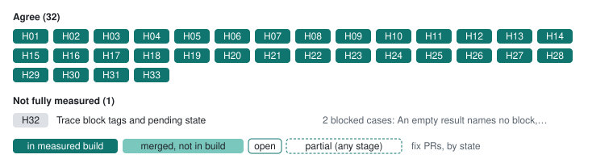

# Geth draft fork: changes to review

The experimental fork follows the adopted source-review stances; its checked cases agree on every assessed decision, including pending simulations, which it runs in a real pending environment; pending block traces stay blocked on the frozen chain’s empty pending block, and one H14 input policy is open; it rejects the H12 raw-transaction block argument, an extension outside the baseline. It is not upstream Geth support or a consensus vote. Filtering remains a bounded scan; pruning still needs runtime coverage.

[All clients](../README.md) · [Client fixes](../../docs/client-fixes.md) · [Source guide](../sources.md)

**Progress on 1.17.7-unstable · e67cfd25** (of 33 decisions): ✅ 31 agree (+1 since the previous capture) · ⚪ 2 not fully measured. Upstream fix PRs: 0 merged, 1 open ([client fixes](../../docs/client-fixes.md)).

Each decision on the development build, grouped as in the [progress chart](../README.md#progress), with the client’s fix PRs ([client fixes](../../docs/client-fixes.md)), styled by stage as its legend shows: in the measured development build, merged but not in that build yet, or open, with a dashed edge when a PR covers only part of the decision.

| Tested version | Commit | Commit date (UTC) | Tested (UTC) |
| --- | --- | --- | --- |
| `1.17.7-unstable` | [`e67cfd25`](https://github.com/banteg/go-ethereum/commit/e67cfd25108049d3765002924460d08fafebb59d) | 2026-10-03 | [2026-10-04](../../evidence/2026-10-04/eval/initial/manifest.json) |

Code links use the tested development sources (or the Geth fork). These are proposed changes for the tested builds. “Checked cases agree” refers to the linked examples, not every behavior of a method. [Test status key](../technical.md#test-status-key).

## Changes to discuss

No differences were found by the selected semantic assertions.

## Open policy observations

These results record behavior whose policy is unresolved. Passing a checked part of a topic does not settle the remaining choices.

| Build | Decision | Observed | Example |
| --- | --- | --- | --- |
| 1.17.7-unstable · e67cfd25 | [Raw-transaction block argument](../decisions/H12.md) | 6 extension cases. Selector block 0x0 by number: rejected as invalid params (-32602: too many arguments, want at most 2). Selector latest: rejected as invalid params (-32602: too many arguments, want at most 2). Selector block 0x19 by number: rejected as invalid params (-32602: too many arguments, want at most 2). Selector block 0x19 by hash: rejected as invalid params (-32602: too many arguments, want at most 2). Selector block 0x19 as an EIP-1898 object: rejected as invalid params (-32602: too many arguments, want at most 2). Selector pending: rejected as invalid params (-32602: too many arguments, want at most 2). | [Raw valid](../cases/initial/raw-valid.md) · [Raw state hash](../cases/raw-selector/raw-state-hash.md) |

## Assessment gaps

| Decision | Build | Reason | Example |
| --- | --- | --- | --- |
| [Unsigned simulation fees and block environment](../decisions/H15.md) | 1.17.7-unstable · e67cfd25 | 1 blocked case: The refund is not independently derived; balances settle within the refund bound. Gas=120918..151147 (root execution gas plus independently calculated Prague intrinsic/floor cost, less any refund), price=2000000000, expected tip=1998322570/gas, burn=1677430/gas, blob fee and destroyed wei=0. 4 blocked cases: The refund is not independently derived; balances settle within the refund bound. Gas=21000..23137 (root execution gas plus independently calculated Prague intrinsic/floor cost, less any refund), price=2000000000, expected tip=1998322570/gas, burn=1677430/gas, blob fee and destroyed wei=0. 2 blocked cases: The refund is not independently derived; balances settle within the refund bound. Gas=21700..26335 (root execution gas plus independently calculated Prague intrinsic/floor cost, less any refund), price=2000000000, expected tip=1998322570/gas, burn=1677430/gas, blob fee and destroyed wei=0. 4 blocked cases: The refund is not independently derived; balances settle within the refund bound. Gas=34829..43536 (root execution gas plus independently calculated Prague intrinsic/floor cost, less any refund), price=2000000000, expected tip=1998322570/gas, burn=1677430/gas, blob fee and destroyed wei=0. | [Many storage write read](../cases/a/many-storage-write-read.md) · [Many storage write revert read](../cases/a/many-storage-write-revert-read.md) |
| [Trace block tags and pending state](../decisions/H32.md) | 1.17.7-unstable · e67cfd25 | 2 blocked cases: An empty result names no block, so it cannot show a pending environment. | [Block pending](../cases/h30/block-pending.md) · [Replay pending](../cases/h30/replay-pending.md) |

✅ Behaviors with no difference in the checked cases

| Behavior | Examples |
| --- | --- |
| [trace_get selector and return shape](../decisions/H02.md) | [_reference/block/0x30](../cases/a/_reference/block/0x30.md) · [Block 2](../cases/a/block-2.md) |
| [Filter composition and mode](../decisions/H03.md) | [Filter all](../cases/a/filter-all.md) · [Filter both unknown mode](../cases/a/filter-both-unknown-mode.md) |
| [Empty address lists](../decisions/H04.md) | [Filter both null](../cases/a/filter-both-null.md) · [Filter from empty to set](../cases/a/filter-from-empty-to-set.md) |
| [Post-merge reward records](../decisions/H05.md) | [_reference/block/0x30](../cases/a/_reference/block/0x30.md) · [Block 2](../cases/a/block-2.md) |
| [Missing transactions and paths](../decisions/H06.md) | [Missing block block](../cases/a/missing-block-block.md) · [Missing block call](../cases/a/missing-block-call.md) |
| [Replay transactionHash field](../decisions/H07.md) | [Replay 35](../cases/forks/replay-35.md) · [Replay 36](../cases/forks/replay-36.md) |
| [Empty output and unrequested components](../decisions/H08.md) | [Auth clear](../cases/a/auth-clear.md) · [Auth replace](../cases/a/auth-replace.md) |
| [Failed frame results and error labels](../decisions/H09.md) | [Auth replace](../cases/a/auth-replace.md) · [Auth set revert](../cases/a/auth-set-revert.md) |
| [Creation result field names](../decisions/H10.md) | [Call mixed create](../cases/a/call-mixed-create.md) · [Model empty runtime](../cases/coverage/model-empty-runtime.md) |
| [Empty trace-type selection](../decisions/H11.md) | [Empty types](../cases/a/empty-types.md) · [Call empty types](../cases/initial/call-empty-types.md) |
| [Raw-transaction block argument](../decisions/H12.md) | [Raw valid](../cases/initial/raw-valid.md) · [Raw state hash](../cases/raw-selector/raw-state-hash.md) |
| [Signed transaction execution validity](../decisions/H13.md) | [Raw below basefee](../cases/a/raw-below-basefee.md) · [Raw insufficient funds](../cases/a/raw-insufficient-funds.md) |
| [Invalid parameters and rejected calls](../decisions/H14.md) | [Call null mode](../cases/a/call-null-mode.md) · [Call scalar mode](../cases/a/call-scalar-mode.md) |
| [Fee accounting and sequential state diffs](../decisions/H16.md) | [Many storage write read](../cases/a/many-storage-write-read.md) · [Many storage write revert read](../cases/a/many-storage-write-revert-read.md) |
| [New-account stateDiff encoding](../decisions/H17.md) | [Prefunded empty](../cases/a/prefunded-empty.md) · [Model empty runtime](../cases/coverage/model-empty-runtime.md) |
| [EIP-7702 code changes in stateDiff](../decisions/H18.md) | [Auth clear](../cases/a/auth-clear.md) · [Auth replace](../cases/a/auth-replace.md) |
| [vmTrace executing bytecode](../decisions/H19.md) | [Auth clear](../cases/a/auth-clear.md) · [Auth replace](../cases/a/auth-replace.md) |
| [vmTrace step timing and deltas](../decisions/H20.md) | [Call gas7400](../cases/a/call-gas7400.md) · [Call mcopy](../cases/a/call-mcopy.md) |
| [vmTrace numeric and optional metadata encoding](../decisions/H21.md) | [Auth clear](../cases/a/auth-clear.md) · [Auth replace](../cases/a/auth-replace.md) |
| [Precompile return bytes](../decisions/H22.md) | [Call identity](../cases/initial/call-identity.md) |
| [Special-action address matching](../decisions/H23.md) | [Filter all](../cases/a/filter-all.md) · [Filter both null](../cases/a/filter-both-null.md) |
| [Sibling failure isolation](../decisions/H24.md) | [Call siblings revert ok](../cases/a/call-siblings-revert-ok.md) · [Nested call outer0 value1 failed](../cases/precompile-values/nested-call-outer0-value1-failed.md) |
| [Well-formed errors for rejected raw transactions](../decisions/H25.md) | [Auth clear](../cases/a/auth-clear.md) · [Auth replace](../cases/a/auth-replace.md) |
| [Account deletion across Cancun](../decisions/H26.md) | [Destroy trace 55](../cases/fork-followup/destroy-trace-55.md) · [Destroy trace 56](../cases/fork-followup/destroy-trace-56.md) |
| [Filter execution across fork boundaries](../decisions/H27.md) | [Filter two blocks](../cases/a/filter-two-blocks.md) · [Filter 35](../cases/forks/filter-35.md) |
| [Historical state at system-operation boundaries](../decisions/H28.md) | [Beacon call 55](../cases/fork-followup/beacon-call-55.md) · [Beacon call 56](../cases/fork-followup/beacon-call-56.md) |
| [Precompile call-frame inclusion](../decisions/H29.md) | [Block 2](../cases/a/block-2.md) · [Filter all](../cases/a/filter-all.md) |
| [Omitted trace_filter range bounds](../decisions/H30.md) | [Filter no bounds](../cases/h30/filter-no-bounds.md) · [Filter to 2 implicit from](../cases/h30/filter-to-2-implicit-from.md) |
| [Omitted trace_callMany block](../decisions/H31.md) | [Call number default](../cases/h30/call-number-default.md) · [Call number latest](../cases/h30/call-number-latest.md) |
| [Single-block hash selection in trace_filter](../decisions/H33.md) | [Filter blockhash](../cases/h30/filter-blockhash.md) · [Filter blockhash address from](../cases/h30/filter-blockhash-address-from.md) |

[Method availability](../decisions/H01.md) · [All decisions](../../decisions/README.md)

For setup gaps, exact run inventories and reproduction, see the [technical appendix](../technical.md).
